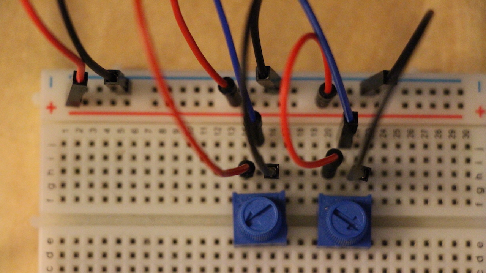
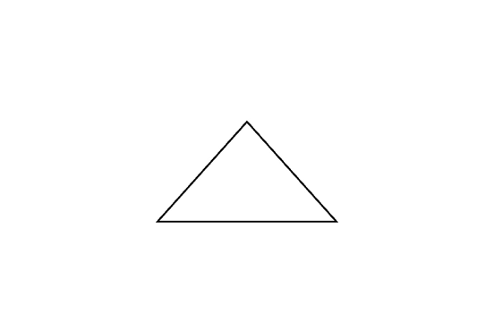
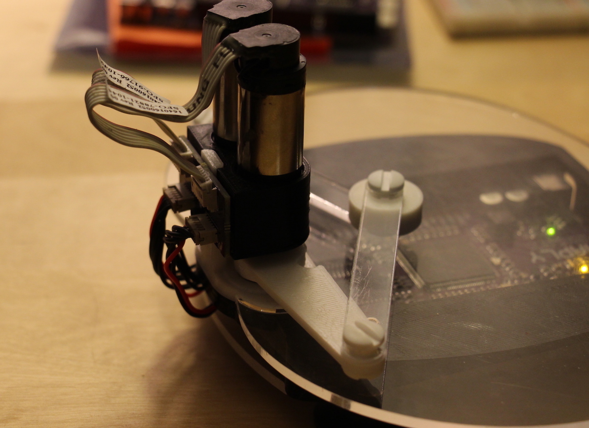
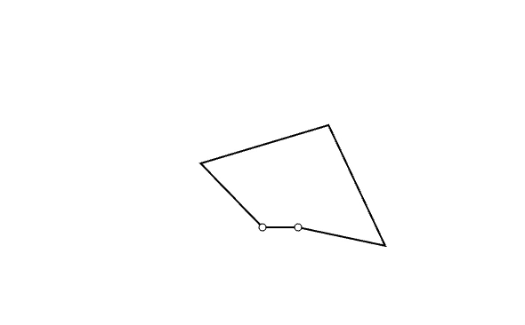

# Welcome to Getting Started!

These lessons will take you through some quick and basic steps to get you started sending __angles__ from either __potentiometers__ or your __Haplet__ into your __computer__ for visualization.

## Recommended Order
Each of these files contains information independant from every other one, but the recommended order by which to go through these lessons is as follows -

1. [Two Pots To Angles](../01_Getting%20Started/01_TwoPotsToAngles.md)

2. [Angles To Kite PDE](../01_Getting%20Started/02_AnglesToKite_PDE.md)

3. [Haplet To Angles](../01_Getting%20Started/03_HapletToAngles.md)

4. [Angles To Haplet PDE](../01_Getting%20Started/04_AnglesToHaplet_PDE.md)

