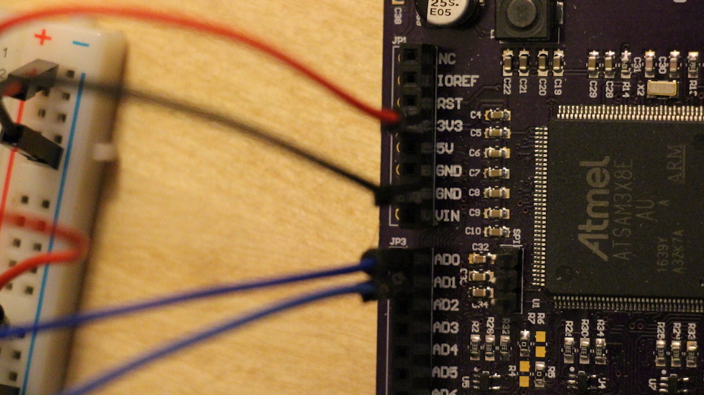

# Potentiometers to Angles

## Setting up the Breadboard
This lesson will begin with setting up potentiometers (pots for short) on a breadboard attached to your Haply board. Once set up, we'll go through the code necessary to read the data from those potentiometers and send it to your computer in real time.

See the images below for the setup of the breadboard, and attachment to the Haply board. As a general convention, ground jumper cables are black, while voltage input cables are red. I'm using blue jumpers to transfer analog data as output from the potentiometers.




In case the above image is hard to see, the red (voltage input) cable goes into the 3V3 pin, which outputs 3.3 Volts. The black (ground) cable connects to the GND pin, and the two blue cables are plugged into the AD0 and AD1 pins. The AD pins are mentioned further in the following code.

## Into the Code
Now that the breadboard is all set up, lets move onto the code. See comments in the code for notes.

```C
// Reads the data of two potentiometers and writes it on the serial port as a buffer filled with two bytes.

#define BAUD 9600

void setup() {
  // initialize the serial communication:
  SerialUSB.begin(9600);
  
  // set resolution to 8 bit, so each reading requires only a byte of data;
  // and the two readings can be sent at once as a buffer of two byte.
  // Note that this is only one easy way of solving the problem, and the accuracy is enough for visualization purposes
  analogReadResolution(8);
  pinMode(A0,INPUT);
  pinMode(A1,INPUT);
}

void loop() {
  
  //define a two byte array to send over the serial port
  byte buf[2];
  
  buf[0]=analogRead(A0); // first entry of the buffer filled with the byte read from the first potentiometer
  buf[1]=analogRead(A1); // second entry of the buffer filled with the byte read from the second potentiometer
  SerialUSB.write(buf ,2); // Use the "write" function instead of "println" to write the data as a byte array (instead of a character string)

  // wait a bit for the ADC to stabilize after the last reading:
  delay(5);
}
```
## Next Steps
The code to read the data from the potentiometers is complete, and the Haply board is attached to our computer. We have a 2-byte array being passed through the serial port, now we need to write code to read and interpret the byte array into a visualization. Move on to the file ["AnglesToKite_PDE.md"](../01_Getting%20Started/02_AnglesToKite_PDE.md) for the next steps!
