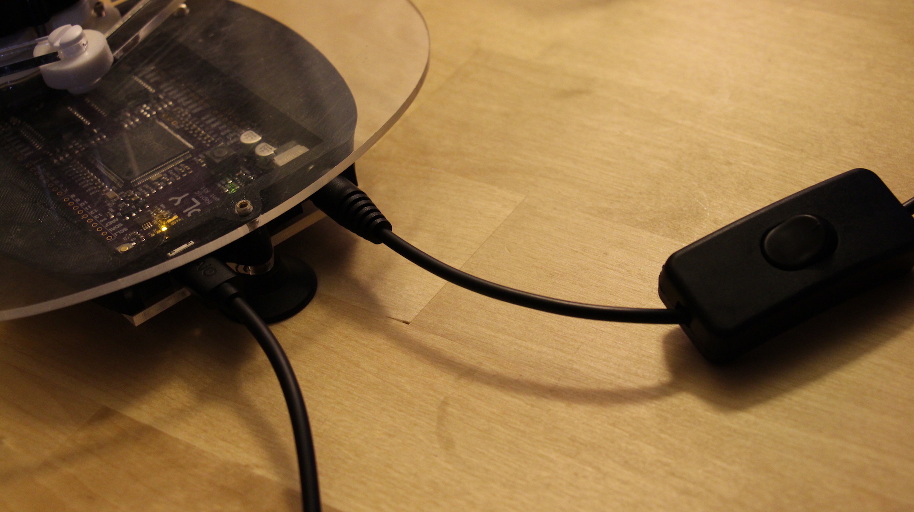
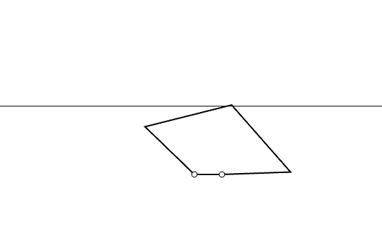
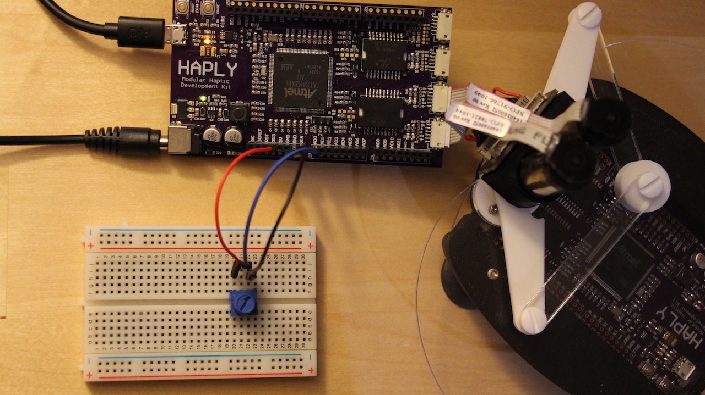
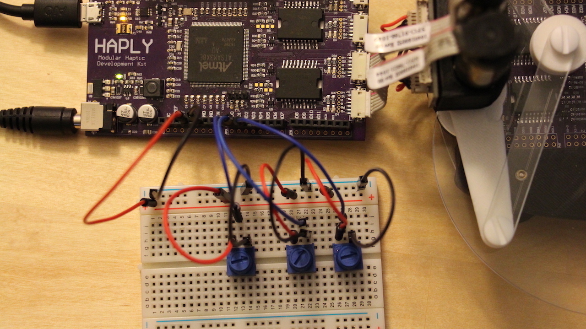

# Welcome to Working with Walls!

These lessons will build on the basic knowledge already accumulated, and bring in properties of __real physical elements__. As the title suggests we'll be focusing our attention on __walls__, but throughout these lessons we'll discuss how elements of walls can be __extrapolated__ to a variety of __other haptic environments__.

## Recommended Order

You'll find that these lessons build on eachother quite a bit, as we'll be starting with a basic wall and messing with the parameters as we go on. WIth that in mind, see below for the recommeded lesson order -

1. [Haplet To Angles to Wall](../02_Working%20with%20Walls/01_HapletToAngles_Wall.md)

2. [Angles To Haplet PDE to Wall](../02_Working%20with%20Walls/02_AnglesToHaplet_Wall_PDE.md)

3. [Haplet To Angles to Stiff Wall](../02_Working%20with%20Walls/03_HapletToAngles_WallStiffness.md)

4. [Haplet To Angles to Stiff Dampening Wall](../02_Working%20with%20Walls/04_HapletToAngles_WallStiffnessDamper.md)

5. [Angles to Haplet PDE to Complete Wall](../02_Working%20with%20Walls/05_HapletToAngles_CompleteWall.md)

6. [Haplet to Angles to Stiff Dampening Moving Wall](../02_Working%20with%20Walls/06_AnglesToHaplet_MovingWall_PDE.md)

