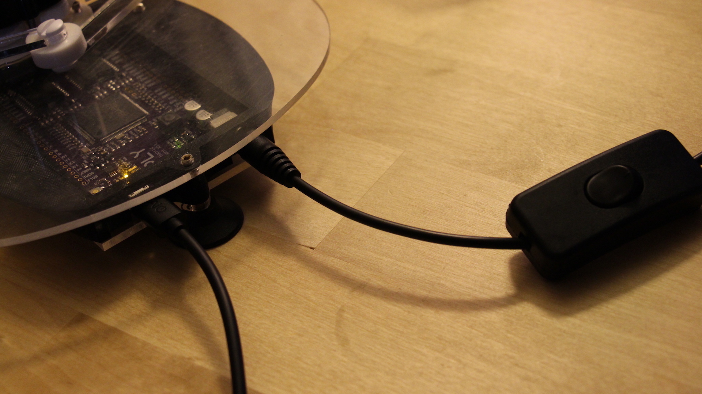

# The Basic Wall

Now that we've covered and understood the basics of how to read outputs from the haplet into animations on our computer using processing, we can turn our attention to how to make the Haplet into a haptic device. The basic concept of doing this is to send a torque (or force) output from our computer back through the motors and along the arms of the Haplet. Since we can track the Haplet's movement using the code from the last set of lessons, we can "trigger" our force output with a dependancy on the position of the end effector of the Haplet. The simplest form of this is a line which upon reaching will result in a force away from the line. In a flat plane, this is also known as a wall!

# Setup
For this lesson you don't have to worry about the potentiometer setups; for now we'll just be using the Haplet. But we'll get back to some potentiometer work in later lessons, so don't forget about them completely.

However, since more than 3.3 Volts is required to have our wall push back, we'll be using external power. Luckily this is easy with the Haply board, just plug the external power source.

Plug the power in to the Haply board as shown below.



# Code
```C
#include <stdlib.h>
#include <Encoder.h>
#include <pwm01.h>

//pin assignment
#define ENCJ21 28
#define ENCJ22 29
#define ENCJ2pwm 8
#define ENCJ2dir 22
#define ENCJ31 24
#define ENCJ32 25
#define ENCJ3pwm 9
#define ENCJ3dir 26

//rates defined
#define BAUD 9600
uint32_t PWMfreq=40000; //unsigned integer, 32 bits. more direct way to declare data type

//data to output
byte buf[] = {0,0};

//angles of arms, in degrees and radians
float th1_deg;
float th2_deg;
float th1;
float th2;

//defined dimensions - in processing will be scaled up x2000. This was empirically determined
float l= 0.05; //0.05 haplet arm length
float d= 0.02; //distance between arms at haplet base
float L= 0.065; //0.065 other haplet arm length

//wall parameters - in processing will be scaled up x2000. This was empirically determined
float y_W=0.05; // wall's position
float k_W=1000;  // wall's spring constant

//encoder pins
Encoder myEnc1(ENCJ21, ENCJ22);
Encoder myEnc2(ENCJ31, ENCJ32);

void setup() {
  SerialUSB.begin(BAUD);
  //inital values for arms- always start flat
  myEnc1.write(180.0*13856.0/360.0);
  myEnc2.write(0);

  //PWM motor init
  pinMode(ENCJ2pwm, OUTPUT);
  pinMode(ENCJ3pwm, OUTPUT);
  pinMode(ENCJ2dir, OUTPUT);
  pinMode(ENCJ3dir, OUTPUT);
  pwm_set_resolution(12);
  pwm_setup(ENCJ2pwm, PWMfreq, 1);
  pwm_setup(ENCJ3pwm, PWMfreq, 1);
  
}

void loop() {
  // reading angles in degrees and radians
  th1_deg = 360.0/13824.0*myEnc1.read();
  th2_deg = 360.0/13824.0*myEnc2.read();
  th1 = th1_deg*3.14159/180.0;
  th2 = th2_deg*3.14159/180.0;

  buf[0]=round(th1_deg);
  buf[1]=round(th2_deg)+80;
  
  SerialUSB.write(buf,2);

  // Forward Kinematics
  float c1=cos(th1);
  float c2=cos(th2);
  float s1=sin(th1);
  float s2=sin(th2);
  float xA=l*c1;
  float yA=l*s1;
  float xB=d+l*c2;
  float yB=l*s2;
  float R=pow(xA,2) +pow(yA,2);
  float S=pow(xB,2)+pow(yB,2);
  float M=(yA-yB)/(xB-xA);
  float N=0.5*(S-R)/(xB-xA);
  float a=pow(M,2)+1;
  float b=2*(M*N-M*xA-yA);
  float c=pow(N,2)-2*N*xA+R-pow(L,2);
  float Delta=pow(b,2)-4*a*c;
  float y_E=(-b+sqrt(Delta))/(2*a);
  float x_E=M*y_E+N;
  
  // Jacobian elements J^T=[J11,J12;J21,J22]
  float phi1=acos((x_E-l*c1)/L);
  float phi2=acos((x_E-d-l*c2)/L);
  float s21=sin(phi2-phi1);
  float s12=sin(th1-phi2);
  float s22=sin(th2-phi2);
  float J11=-(s1*s21+sin(phi1)*s12)/s21;
  float J12=(c1*s21+cos(phi1)*s12)/s21;
  float J21=sin(phi1)*s22/s21;
  float J22=-cos(phi1)*s22/s21;

  // contact force with the virtual wall
  float f_x=0; // forces at zero if no penetration into wall
  float f_y=0;
  float p_W=y_E-y_W; // penetration amount into the wall
if (p_W>0) { // if statement encapsulates below, if wall is penetrated
    f_y=k_W*p_W; // force equation

  // torques to be rendered: tau=J^T*f
  float tau1=J11*f_x+J12*f_y;
  float tau2=J21*f_x+J22*f_y;
  tau2=-tau2;

  //directional motor command
  if (tau1 <=0){
    digitalWrite(ENCJ2dir, HIGH);
  }
  else{
    digitalWrite(ENCJ2dir, LOW);
  }

  if (tau2 <=0){
    digitalWrite(ENCJ3dir, HIGH);
  }
  else{
    digitalWrite(ENCJ3dir, LOW);
  }
//torque to apply
  tau1= abs(tau1);
  tau2= abs(tau2);
  if (tau1>1){
    tau1=1;
  }
  if (tau2>1){
    tau2=1;
  }
  //torque to duty cycle
  int duty1=4095*tau1;
  int duty2=4095*tau2;

  pwm_write_duty(ENCJ2pwm, duty1);
  pwm_write_duty(ENCJ3pwm, duty2);  
}
else{ //if no force on wall
  pwm_write_duty(ENCJ2pwm, 0);
  pwm_write_duty(ENCJ3pwm, 0); 
}
}
```
Looking at the code, you'll see some familiar lines. We're still using the same method to send data, and the basic order of processes should still look the same. A small addition here is the inclusion of code defining the wall distance and spring constant (Walls are just really really stiff springs, after all). Slightly more important to understand is the forward kinematics and contact force sections. Remember in the previous lesson how we used forward kinematics to translate angles into the position of the end effector? We can use this position to determine our distance from the wall, after which we can pull our force trigger once we are touching or past the wall. Part of the result of foward kinematics here are solutions to the Jacobian matrix values, which we can use to transform our forces into torques, which is what the motors will naturally output to the end effector.

# Wall Done, Now to Visualize!

So now we have our output forces, and after writing and running the correct code to your Haplet you'll see that there will be an invisible wall you can't push past! The only thing left now is to visualize this in Processing, this will give us a better idea of where exactly our wall is. Move on to the [AnglesToHaplet_Wall_PDE](../02_Working%20with%20Walls/02_AnglesToHaplet_Wall_PDE.md)
to see how this is done!
