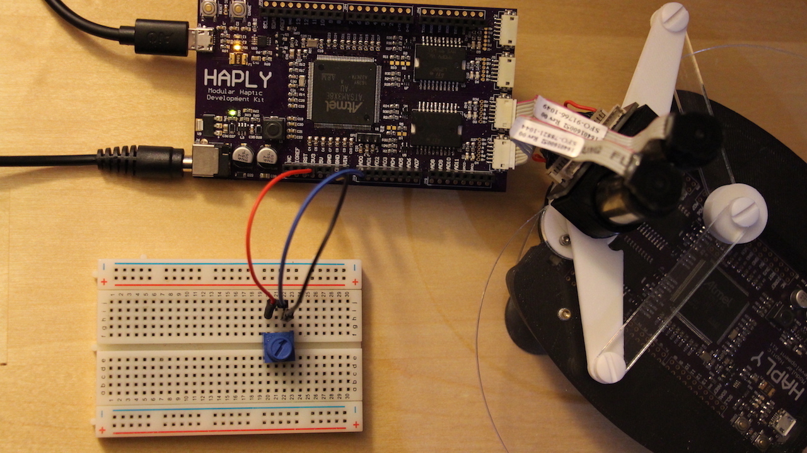

# Stiff Wall

As mentioned previously, we can think of walls and barriers as being analogous to springs with varying spring constants. Since we have the basics of building a wall down, we can take code which we used on our initial wall and vary parameters which can change the nature of the wall. In this lesson, we'll be focusing our attention on the spring constant of the wall.

## Setup
In this lesson we'll be using a potentiometer along with the Haplet, see the photo below for the setup.



In case the photo isn't clear, the potentiometer ground and power pins correspond to GND and 3V3, while the analog output corresponds to AD0. This is reflected in the code below.

## Code
This code is based heavily on the code from the first lesson in this section, so it may help to refer back to the basics if you're having trouble here.

```C
#include <stdlib.h>
#include <Encoder.h>
#include <pwm01.h>

//pin assignment
#define ENCJ21 24
#define ENCJ22 25
#define ENCJ2pwm 8
#define ENCJ2dir 22
#define ENCJ31 28
#define ENCJ32 29
#define ENCJ3pwm 9
#define ENCJ3dir 26
#define POTvalue A0

//rates defined
#define BAUD 9600
uint32_t PWMfreq=40000; //unsigned integer, 32 bits. more direct way to declare data type

//data to output
byte buf[] = {0,0};

//angles of arms, in degrees and radians
float th1_deg;
float th2_deg;
float th1;
float th2;

//defined dimensions - in processing will be scaled up x2000. This was empirically determined
float l= 0.05; //0.05 cm to wall
float d= 0.02; //distance between arms at haplet base
float L= 0.065; //0.065 haplet arm length

//wall parameters - in processing will be scaled up x2000. This was empirically determined
float y_W=0.05; // wall's position
float k_W; //Pot input ranges from 0 to 1023 (10 bit reading), so it will be mapped to go from 10 to 1000
// k_W represents the wall's spring constant

//encoder pins
Encoder myEnc1(ENCJ21, ENCJ22);
Encoder myEnc2(ENCJ31, ENCJ32);

void setup() {
  SerialUSB.begin(BAUD);
  //inital values for arms- always start flat
  myEnc1.write(180.0*13856.0/360.0);
  myEnc2.write(0);

  //Pot input resolution
  analogReadResolution(10);

  //PWM motor init
  pinMode(ENCJ2pwm, OUTPUT);
  pinMode(ENCJ3pwm, OUTPUT);
  pinMode(ENCJ2dir, OUTPUT);
  pinMode(ENCJ3dir, OUTPUT);
  pwm_set_resolution(12);
  pwm_setup(ENCJ2pwm, PWMfreq, 1);
  pwm_setup(ENCJ3pwm, PWMfreq, 1);
  
}

void loop() {
  //setting wall stiffness
  k_W= analogRead(POTvalue);
  k_W= map(k_W, 0, 1023, 0, 10000); // mapping values as mentioned above

  // reading angles in degrees and radians
  th1_deg = 360.0/13824.0*myEnc1.read();
  th2_deg = 360.0/13824.0*myEnc2.read();
  th1 = th1_deg*3.14159/180.0;
  th2 = th2_deg*3.14159/180.0;

  buf[0]=round(th1_deg);
  buf[1]=round(th2_deg)+80;
  
  SerialUSB.write(buf,2);

  // Forward Kinematics
  float c1=cos(th1);
  float c2=cos(th2);
  float s1=sin(th1);
  float s2=sin(th2);
  float xA=l*c1;
  float yA=l*s1;
  float xB=d+l*c2;
  float yB=l*s2;
  float R=pow(xA,2) +pow(yA,2);
  float S=pow(xB,2)+pow(yB,2);
  float M=(yA-yB)/(xB-xA);
  float N=0.5*(S-R)/(xB-xA);
  float a=pow(M,2)+1;
  float b=2*(M*N-M*xA-yA);
  float c=pow(N,2)-2*N*xA+R-pow(L,2);
  float Delta=pow(b,2)-4*a*c;
  float y_E=(-b+sqrt(Delta))/(2*a);
  float x_E=M*y_E+N;
  
  // Jacobian elements J^T=[J11,J12;J21,J22]
  float phi1=acos((x_E-l*c1)/L);
  float phi2=acos((x_E-d-l*c2)/L);
  float s21=sin(phi2-phi1);
  float s12=sin(th1-phi2);
  float s22=sin(th2-phi2);
  float J11=-(s1*s21+sin(phi1)*s12)/s21;
  float J12=(c1*s21+cos(phi1)*s12)/s21;
  float J21=sin(phi1)*s22/s21;
  float J22=-cos(phi1)*s22/s21;

  // contact force with the virtual wall
  float f_x=0; // forces at zero if no penetration into wall
  float f_y=0;
  float p_W=y_E-y_W; // penetration amount into the wall
if (p_W>0) { // if statement encapsulates below
    f_y=-k_W*p_W;// force equation

  // torques to be rendered: tau=J^T*f
  float tau1=J11*f_x+J12*f_y;
  float tau2=J21*f_x+J22*f_y;
  tau2=-tau2;

  //directional motor command
  if (tau1 <=0){
    digitalWrite(ENCJ2dir, HIGH);
  }
  else{
    digitalWrite(ENCJ2dir, LOW);
  }

  if (tau2 <=0){
    digitalWrite(ENCJ3dir, HIGH);
  }
  else{
    digitalWrite(ENCJ3dir, LOW);
  }
//torque to apply
  tau1= abs(tau1);
  tau2= abs(tau2);
  if (tau1>1){
    tau1=1;
  }
  if (tau2>1){
    tau2=1;
  }
  //torque to duty cycle
  int duty1=4095*tau1;
  int duty2=4095*tau2;

  pwm_write_duty(ENCJ2pwm, duty1);
  pwm_write_duty(ENCJ3pwm, duty2);  
}
else{ //if no force on wall
  pwm_write_duty(ENCJ2pwm, 0);
  pwm_write_duty(ENCJ3pwm, 0); 
}
}
```
The primary differences in the code here relate to the declaration of a new variable, which we will use to change the wall's spring constant. Follow this variable through the code to see how it is finally used in our force equation. It may be useful to recall the methods used to read potentiometer values from previous sections as well.

## Next Steps
To visualize this code, run our visualization code from last lesson. Since our wall is in the same position as before, this should work just fine. Now, try to mess with the code a little bit. Change the spring constant dramatically higher, see what happens. Notice how shaky the end effector becomes? Lets talk a bit about that.

Our spring is pushing against us as we push towards it, but since our spring constant is so high its causing an overshooting effect which is constantly self correcting. This is hard to visualize in the real world, but imagine a spring that actively put energy into the system. This is a similar situation. In order to remedy this, we can do two things. First is to "tune" our spring constant so that we aren't overshooting. Another option is add a damper, which you can think of in the real world as dashpot (google it if you havent seen one before, I had to when I first learned about this). We'll investigate this in the following [lesson](../02_Working%20with%20Walls/04_HapletToAngles_WallStiffnessDamper.md).
