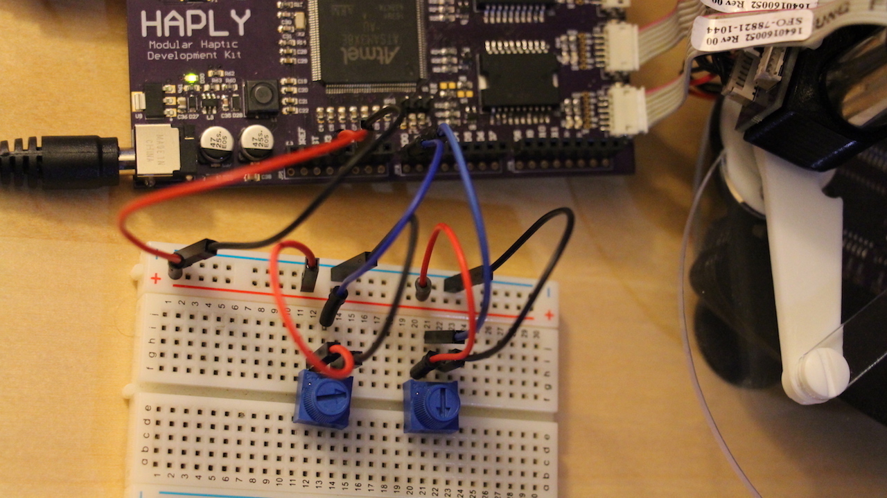

# Putting a Damper on Things
As mentioned before, adding a dampening component to our force equation will keep us from overshooting our position targets. By tuning our spring constant and dampening parameters, we'll be able to create a wide variety of virtual environments.

## Setup
For this setup we'll be adding a second potentiometer to our breadboard, similar to when we were using two potentiometers to control a kite. See the photo below for the configuration.



## Code
The code below is based on the code from last lesson, but you'll see an additional variable created which controls the dampening parameter. Something of note is the mathematics being used here, stemming from the fact that the dampening parameter requires a differential term. We take advantage of micros() function here, which outputs the time in microseconds since the code has been running, to give us time readings for this term.

```C
#include <stdlib.h>
#include <Encoder.h>
#include <pwm01.h>

//pin assignment
#define ENCJ21 24
#define ENCJ22 25
#define ENCJ2pwm 8
#define ENCJ2dir 22
#define ENCJ31 28
#define ENCJ32 29
#define ENCJ3pwm 9
#define ENCJ3dir 26
#define POTk_W A0
#define POTb_W A1
#define TIMER 1000 // upper bound for simulation to feel realistic (micros)

//rates defined
#define BAUD 9600
uint32_t PWMfreq=40000;//unsigned integer, 32 bits. more direct way to declare data type

//data to output
byte buf[] = {0,0};

//angles of arms, in degrees and radians
float th1_deg;
float th2_deg;
float th1;
float th2;

//defined dimensions - in processing will be scaled up x2000. This was empirically determined
float l= 0.05; //0.05 cm to wall
float d= 0.02; //distance between arms at haplet base
float L= 0.065; //0.065 haplet arm length

//wall parameters - in processing will be scaled up x2000. This was empirically determined
float y_W=0.05; // wall's position

//encoder pins
Encoder myEnc1(ENCJ21, ENCJ22);
Encoder myEnc2(ENCJ31, ENCJ32);

//K and B parameters - for wall's spring constant and dampening constant
float POTb, POTk;
float k_W; //Pot input ranges from 0 to 1023 (10 bit reading), so it will be mapped
float b_W; //Dampening parameter
double y_E_old;
float t_old;

void setup() {
  SerialUSB.begin(BAUD);
  //inital values for arms- always start flat
  myEnc1.write(180.0*13856.0/360.0);
  myEnc2.write(0);

  //Pot input resolution
  analogReadResolution(10);

  //PWM motor init
  pinMode(ENCJ2pwm, OUTPUT);
  pinMode(ENCJ3pwm, OUTPUT);
  pinMode(ENCJ2dir, OUTPUT);
  pinMode(ENCJ3dir, OUTPUT);
  pwm_set_resolution(12);
  pwm_setup(ENCJ2pwm, PWMfreq, 1);
  pwm_setup(ENCJ3pwm, PWMfreq, 1);
  
}

void loop() {
  // time must be included due to differential term for dampening constant
  float t = micros();
  //setting tuning parameters
  POTk= analogRead(POTk_W);
  POTb= analogRead(POTb_W);
  k_W= map(POTk, 0, 1023, 0, 5000); // comment this line to hardcode k_W
  //k_W=400.0; // uncomment this line to hardcode k_W

  //Dampening constant
  b_W = map(POTb, 0, 1023, 0, 1000); // comment this line to hardcode b_W
  //b_W = 420.0; // uncomment this line to hardcode b_W

 // reading angles in degrees and radians
  th1_deg = 360.0/13824.0*myEnc1.read();
  th2_deg = 360.0/13824.0*myEnc2.read();
  th1 = th1_deg*3.14159/180.0;
  th2 = th2_deg*3.14159/180.0;

  buf[0]=round(th1_deg);
  buf[1]=round(th2_deg)+80;
  
  SerialUSB.write(buf,2); // to send to processing

  // Forward Kinematics
  float c1=cos(th1);
  float c2=cos(th2);
  float s1=sin(th1);
  float s2=sin(th2);
  float xA=l*c1;
  float yA=l*s1;
  float xB=d+l*c2;
  float yB=l*s2;
  float R=pow(xA,2) +pow(yA,2);
  float S=pow(xB,2)+pow(yB,2);
  float M=(yA-yB)/(xB-xA);
  float N=0.5*(S-R)/(xB-xA);
  float a=pow(M,2)+1;
  float b=2*(M*N-M*xA-yA);
  float c=pow(N,2)-2*N*xA+R-pow(L,2);
  float Delta=pow(b,2)-4*a*c;
  double y_E=(-b+sqrt(Delta))/(2*a); //brings to cm
  double x_E=M*y_E+N;
  
  // Jacobian elements J^T=[J11,J12;J21,J22]
  float phi1=acos((x_E-l*c1)/L);
  float phi2=acos((x_E-d-l*c2)/L);
  float s21=sin(phi2-phi1);
  float s12=sin(th1-phi2);
  float s22=sin(th2-phi2);
  float J11=-(s1*s21+sin(phi1)*s12)/s21;
  float J12=(c1*s21+cos(phi1)*s12)/s21;
  float J21=sin(phi1)*s22/s21;
  float J22=-cos(phi1)*s22/s21;

if(t-t_old>=TIMER){ //loop control 
   
  // contact force with the virtual wall
  float f_x=0; // forces at zero if no penetration into wall
  float f_y=0; 
  float p_W=y_E-y_W; // penetration amount into the wall
if (p_W>0) { // if statement encapsulates below
    f_y=-k_W*p_W-b_W*(10000*(y_E-y_E_old)/(t-t_old)); //adding damper term here. 10000 is empirically determined

  // torques to be rendered: tau=J^T*f
  float tau1=J11*f_x+J12*f_y;
  float tau2=J21*f_x+J22*f_y;
  tau2=-tau2;

  //directional motor command
  if (tau1 <=0){
    digitalWrite(ENCJ2dir, HIGH);
  }
  else{
    digitalWrite(ENCJ2dir, LOW);
  }

  if (tau2 <=0){
    digitalWrite(ENCJ3dir, HIGH);
  }
  else{
    digitalWrite(ENCJ3dir, LOW);
  }
//torque to apply
  tau1= abs(tau1);
  tau2= abs(tau2);
  if (tau1>1){
    tau1=1;
  }
  if (tau2>1){
    tau2=1;
  }
  //torque to duty cycle
  int duty1=4095*tau1;
  int duty2=4095*tau2;

  pwm_write_duty(ENCJ2pwm, duty1);
  pwm_write_duty(ENCJ3pwm, duty2);  
}
else{ //if no force on wall
  pwm_write_duty(ENCJ2pwm, 0);
  pwm_write_duty(ENCJ3pwm, 0); 
}
 t_old=t;
 y_E_old= y_E;
}
}
```
## Next Steps
Try really experimenting with the above code and the potentiometer values you choose. Notice how with some values the wall becomes impossible to pass and causes overshooting. A similar situation happens when the dampening parameter is set too high. When the spring constant is lowered to almost nothing and the dampening parameter correctly tuned, the wall goes from a spring to honey allowing you to move through it slowly. See how we can use this to replicate many different environments? Move on to the [next lesson](../02_Working%20with%20Walls/05_HapletToAngles_CompleteWall.md) to revisit moving walls with all these possible environments in mind.
