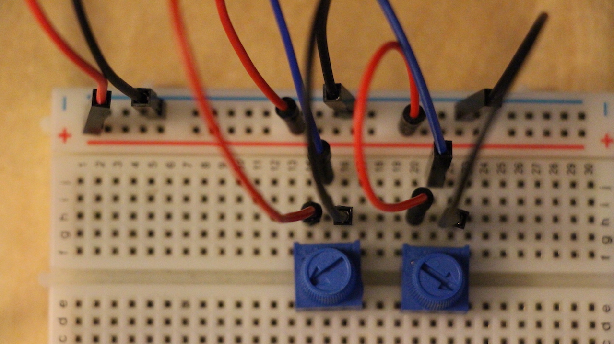
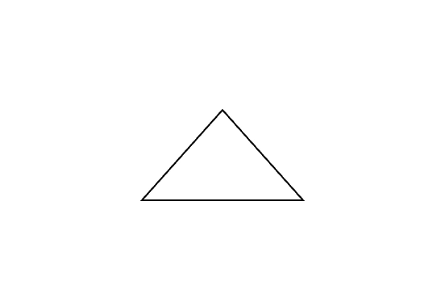
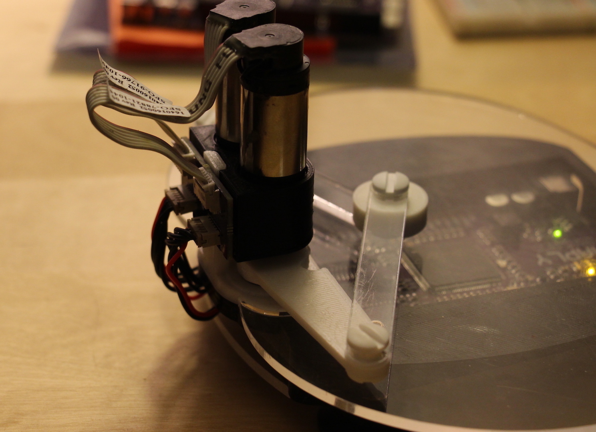
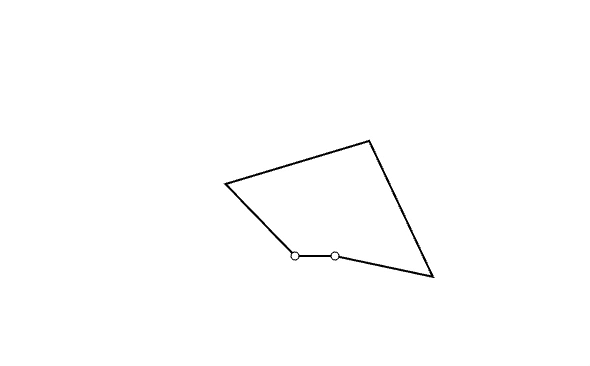
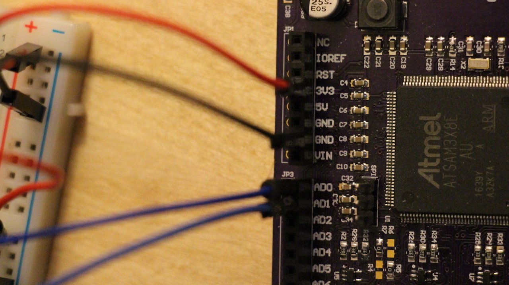
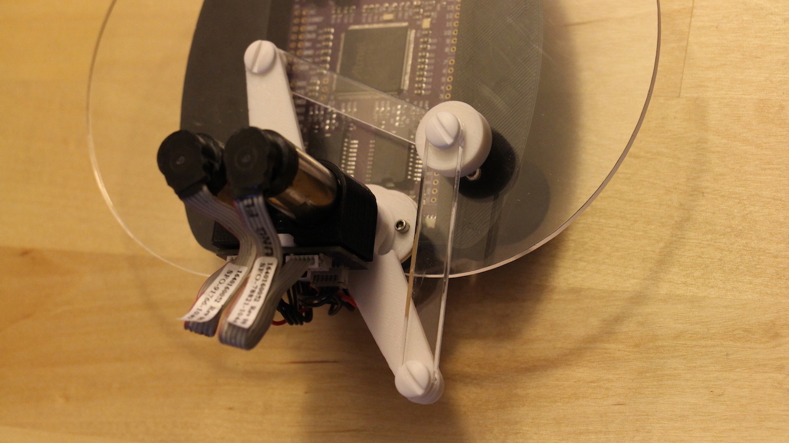

Welcome to Getting Started!
===========================

These lessons will take you through some quick and basic steps to get
you started sending **angles** from either **potentiometers** or your
**Haplet** into your **computer** for visualization.

Recommended Order
-----------------

Each of these files contains information independant from every other
one, but the recommended order by which to go through these lessons is
as follows -

1.  [Two Pots To Angles](../01_Getting%20Started/01_TwoPotsToAngles.md)



2.  [Angles To Kite PDE](../01_Getting%20Started/02_AnglesToKite_PDE.md)



3.  [Haplet To Angles](../01_Getting%20Started/03_HapletToAngles.md)



4.  [Angles To Haplet
    PDE](../01_Getting%20Started/04_AnglesToHaplet_PDE.md)



Potentiometers to Angles
========================

Setting up the Breadboard
-------------------------

This lesson will begin with setting up potentiometers (pots for short)
on a breadboard attached to your Haply board. Once set up, we'll go
through the code necessary to read the data from those potentiometers
and send it to your computer in real time.

See the images below for the setup of the breadboard, and attachment to
the Haply board. As a general convention, ground jumper cables are
black, while voltage input cables are red. I'm using blue jumpers to
transfer analog data as output from the potentiometers.




In case the above image is hard to see, the red (voltage input) cable
goes into the 3V3 pin, which outputs 3.3 Volts. The black (ground) cable
connects to the GND pin, and the two blue cables are plugged into the
AD0 and AD1 pins. The AD pins are mentioned further in the following
code.

Into the Code
-------------

Now that the breadboard is all set up, lets move onto the code. See
comments in the code for notes.

``` C
// Reads the data of two potentiometers and writes it on the serial port as a buffer filled with two bytes.

#define BAUD 9600

void setup() {
  // initialize the serial communication:
  SerialUSB.begin(9600);
  
  // set resolution to 8 bit, so each reading requires only a byte of data;
  // and the two readings can be sent at once as a buffer of two byte.
  // Note that this is only one easy way of solving the problem, and the accuracy is enough for visualization purposes
  analogReadResolution(8);
  pinMode(A0,INPUT);
  pinMode(A1,INPUT);
}

void loop() {
  
  //define a two byte array to send over the serial port
  byte buf[2];
  
  buf[0]=analogRead(A0); // first entry of the buffer filled with the byte read from the first potentiometer
  buf[1]=analogRead(A1); // second entry of the buffer filled with the byte read from the second potentiometer
  SerialUSB.write(buf ,2); // Use the "write" function instead of "println" to write the data as a byte array (instead of a character string)

  // wait a bit for the ADC to stabilize after the last reading:
  delay(5);
}
```

Next Steps
----------

The code to read the data from the potentiometers is complete, and the
Haply board is attached to our computer. We have a 2-byte array being
passed through the serial port, now we need to write code to read and
interpret the byte array into a visualization. Move on to the file
["AnglesToKite\_PDE.md"](../01_Getting%20Started/02_AnglesToKite_PDE.md)
for the next steps!

Angles to Kite
==============

Processing Angles to Animation
------------------------------

In the previous lesson we set up our bread/ Haply board combination and
sent analog readings from two potentiometers as a 2-byte array along the
serial port. Now that we have this array coming in, its time to write
some code to start a kite visualization of the incoming data.

We'll do this using [Processing](https://processing.org/), which is
based in Java rather than C. Processing was originally developed at MIT
as a programming framework for visual artists, and is a great open
source resource for visualization. It has since expanded due to the open
source community to include many other open source tools such and audio
and physics engines. It has a similar structure to
[Arduino](https://www.arduino.cc/) code, you'll see below there is a
similar setup() function. The draw() function is identical to the loop()
function in that it continuously loops, but is different in that it
refreshes at 50 Hz. This is because it was designed with visualization
in mind; 50 Hz around the threshold at which the human eye sees
animations become continuous.

There isn't much setup in this step, simply attach the haply board to
your computer via USB.

Kite Visualization Code
-----------------------

``` C
// Animates a Kite (Symmetric 5-bar) Linkage, based on two bytes
// that are read from the serial port and interpreted as angular positions
// of the two input joints.

import processing.serial.*;

Serial myPort;        // The serial port

//Kite dimensions in pixels. May vary based on your screen size
//In later examples we'll work in meters. My screen is 1440 x 900px, meaning
//that my screen is around 5 pixels per mm. This means that l and L will be
//20 and 30 mm, respectively
int l=100; // length l in pixels
int L=150; // length L in pixels

// define buffers to retrieve angle byte arrays from arduino side
float inByte1;
float inByte2;

// define angles for calculations
float th1;
float th2;

// values to be found from angle calculations
float r;
float psi;
float alpha;

// Defines kite as graphic object
PShape kite;

void setup () {
  // set the window size:
  size(600, 400,P2D);

  // List all the available serial ports
  printArray(Serial.list()); // Uncomment to check out the right number for myPort

  // Open whatever port is the one you're using. (Uncomment the previous command)
  myPort = new Serial(this, Serial.list()[1], 9600);


  // set inital background:
  background(255);
  
  // Here we initialize our graphic object to draw the kite
  kite = createShape();
  kite.beginShape();
  kite.fill(255);
  kite.stroke(0);
  kite.strokeWeight(2);
  
  // Put all the vertices on O as an initial position
  kite.vertex(width/2, 2*height/3); // Create O (Vertex 0)
  kite.vertex(width/2, 2*height/3); // Create A (Vertex 1) 
  kite.vertex(width/2, 2*height/3); // Create E (Vertex 2) 
  kite.vertex(width/2, 2*height/3); // Create B (Vertex 3) 
    
  kite.endShape(CLOSE);
  
  
}

void draw () {
  
   // Expand array size to the number of bytes you expect
   // We sent a 2 byte array of pot values from our initial code in Arduino,
   // So we are expecting a 2 byte array to come over the serial port
  byte[] inBuffer = new byte[2];
  
  while (myPort.available() > 0) {
    inBuffer = myPort.readBytes(); // define inBuffer such that bytes sent from arduino side can be stored
    myPort.readBytes(inBuffer); // read from arduino
    if (inBuffer != null) { //if statement will trigger provided data is available
      
      //As a note: angles are by default in radians
      // Convert the potentiometer readings to unsigned bytes (no direct unsigned datatype in Java) and then map to desired range
      inByte1=(inBuffer[0]>=0) ? float(inBuffer[0])/255.0*PI : float(inBuffer[0]+256)/255.0*PI; // one-liner if-else
      inByte2=(inBuffer[1]>=0) ? float(inBuffer[1])/255.0*PI : float(inBuffer[1]+256)/255.0*PI; // one-liner if-else
      
      // Define angles as distance from the horizantal zero value
      th1=PI-inByte1; // Depending on how the potentiometer1 is facing the screen
      th2=PI-inByte2; // Depending on how the potentiometer2 is facing the screen
      
      background(255); // To clean up the leftovers of previous drawings
      
      
      kite.setVertex(1,width/2+l*cos(th1), 2*height/3-l*sin(th1)); // Vertex A with th1 from potentiometer input
      kite.setVertex(3,width/2+l*cos(th2), 2*height/3-l*sin(th2)); // Vertex B with th2=0
      
      // calculations of psi, alpha, and r. values are needed for animation
      psi=(th1+th2)/2;
      alpha=(th1-th2)/2;
      r=l*cos(alpha)+sqrt(pow(L,2)-pow(l*sin(alpha),2));
       
      kite.setVertex(2,width/2+r*cos(psi), 2*height/3-r*sin(psi)); // Vertex E
      
      shape(kite); // Display the shape
    }
  }
}
```

Visualization Complete!
-----------------------

While Arduino code needs to be flashed onto the Haply board, Processing
code runs natively on your PC. Once you have the data transmitting from
the previous lesson, run the processing code to start the visualization.

It should look something like this! You can move the head of the kite by
turning the knobs of the potentiometers.


Haplet to Angles
================

Reading Angles from Haplet
--------------------------

With a basic understanding of how to visualize output angles from
potentiometers, its time to work with something more reflective of the
data being sent: the Haplet. The motors at the base of the haplet can
output angles, making real time tracking of the haplet possible.

You'll note that the Haplet has a Haply board built in, see the image
below for setup.


Code and Motor Considerations
-----------------------------

Because we are working with motors with built in encoders, the encoder
library will be used. Documentation for this library is available
[here](https://www.pjrc.com/teensy/td_libs_Encoder.html). Compared to
code from the previous sections, you'll note that some code is shown
before the setup() and loop() functions, defining a number of variables.
This is more common practice, and helps to keep code clear and concise.

``` C
// Encoder library necessary for haplet motor operation
#include <Encoder.h>

// Setting pins and baud rate for haply board
#define ENCJ21 28
#define ENCJ22 29
#define ENCJ31 24
#define ENCJ32 25
#define BAUD 9600

// defining 2 byte buffer for receiving angles
byte buf[] = {0,0};

// defining angles
float th1;
float th2;

// defining MyEnc 1 and 2 to match up with pins as defined above
Encoder myEnc1(ENCJ21, ENCJ22);
Encoder myEnc2(ENCJ31, ENCJ32);

void setup() {
  SerialUSB.begin(BAUD);
  // starting angles of haplet must be at 180 and 0 degrees
  myEnc1.write(180.0*13856.0/360.0);
  myEnc2.write(0);
  
}

void loop() {
  // reading angles as degrees, 13824.0 is an empirically found constant
  th1 = 360.0/13824.0*myEnc1.read();
  th2 = 360.0/13824.0*myEnc2.read();

  // putting angles into byte arrays to send
  buf[0]=round(th1);
  buf[1]=round(th2)+80;
  // +80 is to prevent negative values in datatype conversion, will be subtracted in processing
  
  SerialUSB.write(buf,2);

  delay(5);

}
```

Note the similarities and differences between this code and code used in
the previous lesson. A 2-byte buffer array is used to send the encoded
angle data. Use of a buffer array is used commonly as a method to send
and receive data, however there is flexibility in implimentation. Here,
we don't require a high resolution of the data to draw the device so we
pass a single byte that represents each angle. The downside is that we
can only pass an angle with an 8 bit resolution, or about 1.4 degrees
(360 degrees / 256 unique values possible with 8 bits). However, here
the most important lesson is that we must understand what values are
being passed and then interpreted between the computer and the robot. If
the robot is sending an unsigned byte (range 0-255) the Processing
sketch must know this and interpret the data the same way. Since
Processing only uses signed data types, we have to do a little data
jujitsu to make sure that both sides of the serial communication are on
the same page.

An important distinction is that the data here are angles encoded from
the motors, rather than voltages read from potentiometers. The treatment
of this data is slightly more complex, we can already see in this code
that unit conversion is used. Additionally, you'll notice that a +80
constant appears in the treatment of theta 2. This comes about from the
inability of Java (and therefore Processing) to handle unsigned byte
values. In practice, this means that sending negative angle values can
become a source of error in the transmission of data. If you try to
print out the angles being sent from the Haplet when it's arms and
therefore motor are at an angle below the zero point, you'll see
negative values! To combat this, we add 80 degrees, which is sufficient
to keep all angles in the range of the motor greater than zero. On
Processing the only necessary step in this treatment is to subtract 80
degrees from the final angle value. But we'll get to that in the next
lesson.


Photo of an angle in which the Haplet would output a negative angle
value in our code. Notice how this angle is about 80 degrees?

Next Steps
----------

Similarly to previous lessons, we are sending a 2-byte array from the
Haply board to our computer. In next steps we'll use processing again to
visualize the Haply board, move on to
["AnglesToHaplet\_PDE.md"](../01_Getting%20Started/04_AnglesToHaplet_PDE.md)
to see how it's done!

Haplet to Angles
================

Visualizing the Haplet
----------------------

Similar to the previous examples, we're dealing with a 2-byte array
being sent over the serial port from the Haply board into a Processing
sketch on a computer. In this case we're dealing with angles rather than
potentiometer readings, and so slightly different treatments must be
applied. Additionally, in the animation we'll add a gap in the kite to
better represent the Haplet.

Encoded Code
------------

Because we are working with angle values rather than voltages from
potentiometers, certain treatments must be done to keep the data
consistent between Arduino code and Processing code. These were
mentioned in the previous lesson; you'll see these addressed in the code
below as well.

``` C
// Animates a Haplet (Symmetric 5-bar) Linkage, based on two bytes
// that are read from the serial port and interpreted as angular positions
// of the two input joints.

import processing.serial.*;

Serial myPort;

// Haplet dimensions in pixels
int l=100;
int L=150;
int d=40;

// define buffers to retrieve byte arrays from arduino side
float inByte1;
float inByte2;

// define angles for calculations
float th1;
float th2;

// required graphic objects
PShape kite, circle1, circle2;

void setup () {
  // set the window size:
  size(600, 400,P2D);

  // List all the available serial ports
  printArray(Serial.list()); // Uncomment to check out the right number for myPort

  // Open whatever port is the one you're using. (Uncomment the previous command)
  myPort = new Serial(this, Serial.list()[1], 9600);
  
  // set inital background:
  background(255);
  
  // create kite
  kite = createShape();
  kite.beginShape();
  kite.fill(255);
  kite.stroke(0);
  kite.strokeWeight(2);
  
  // Put all the vertices on O or C as an initial position
  kite.vertex(width/2, 2*height/3); // Create O (Vertex 0)
  kite.vertex(width/2, 2*height/3); // Create A (Vertex 1) 
  kite.vertex(width/2, 2*height/3); // Create E (Vertex 2) 
  kite.vertex(width/2+d, 2*height/3); // Create B (Vertex 3) 
  kite.vertex(width/2+d, 2*height/3); // Create C (Vertex 4)  
  kite.endShape(CLOSE);
  
  // draw little circles on motorized joints
  circle1 = createShape(ELLIPSE, width/2, 2*height/3, d/5, d/5); // little circle on O (motor 1)
  circle1.setStroke(color(0));
  circle2 = createShape(ELLIPSE, width/2+d, 2*height/3, d/5, d/5); // little circle on c (motor 2)
  circle2.setStroke(color(0));
  
  
}

void draw () {
  
   // Expand array size to the number of bytes you expect
  byte[] inBuffer = new byte[2];
  
  while (myPort.available() > 0) {
    inBuffer = myPort.readBytes(); // define inBuffer such that bytes sent from arduino side can be stored
    myPort.readBytes(inBuffer); // read from arduino
    if (inBuffer != null) { //if statement will trigger provided data is available
      
      // Convert the serial port readings to unsigned bytes (Remember bytes are unsigned in arduino and signed in processing!)
      inByte1=(inBuffer[0]>=0) ? float(inBuffer[0]) : float(inBuffer[0]+256); // one-liner if-else
      inByte2=(inBuffer[1]>=0) ? float(inBuffer[1]) : float(inBuffer[1]+256); // one-liner if-else
      
      th1=PI/180.0*inByte1;      //convert to radians
      th2=PI/180.0*(inByte2-80); //convert to radians (after subtracting 80 degrees that we had added on the ".ino" side.) 
      
      // forward kinematics
      float c1=cos(th1);
      float c2=cos(th2);
      float s1=sin(th1);
      float s2=sin(th2);
    
      float xA=l*c1;
      float yA=l*s1;
      float xB=d+l*c2;
      float yB=l*s2;
      float R=pow(xA,2) +pow(yA,2);
      float S=pow(xB,2)+pow(yB,2);
      float M=(yA-yB)/(xB-xA);
      float N=0.5*(S-R)/(xB-xA);
      float a=pow(M,2)+1;
      float b=2*(M*N-M*xA-yA);
      float c=pow(N,2)-2*N*xA+R-pow(L,2);
      float Delta=pow(b,2)-4*a*c;
      float y_E=(-b+sqrt(Delta))/(2*a);
      float x_E=M*y_E+N;
      
      // Update graphics
      background(255); // To clean up the left-overs of drawings from the previous loop!
      kite.setVertex(1,width/2+l*cos(th1), 2*height/3-l*sin(th1)); // Vertex A with th1 from encoder reading
      kite.setVertex(3,width/2+d+l*cos(th2), 2*height/3-l*sin(th2)); // Vertex B with th2 from encoder reading
      kite.setVertex(2,width/2+x_E, 2*height/3-y_E); // Vertex E from Fwd Kin calculations
      shape(kite); // Display the kite
      shape(circle1);
      shape(circle2);
    }
  }
}
```

You'll see commonalities between the above code and the simpler code
used to read potentiometers, but a significant difference that is worth
mentioning is the use of forward kinematics. It is useful to think of
forward kinematics as a function independant from the rest of the code,
into which you angles are fed. The output of forward kinematics is
position, and so in effect forward kinematics translate angles into the
end position, or end-effector. This is where a robot may perform a task,
such as picking and placing objects, or where a person may hold on to
the robot for interfacing. Forward kinematics comes in handy in many
cases, we'll use it much more in later lessons.

See below for a visualization.


Summary
-------

Now that we've gone over the basics of tracking the Haplet in real time
visualization, there are a multitude of other things we can do!

The next topics we can cover in working with the Haplet are programming
realistic haptic simulations such as walls and dampers, lessons under
"Working with Walls" will take you through the steps!
