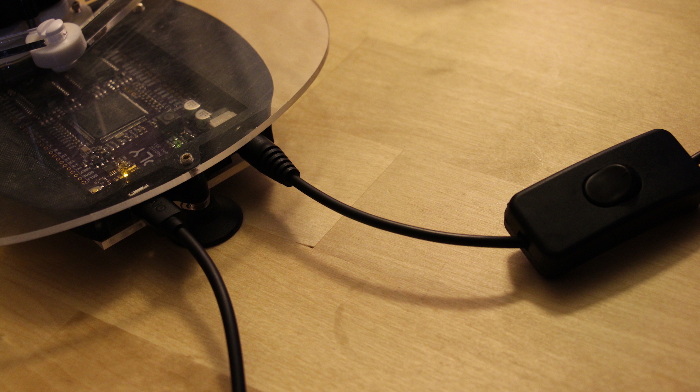
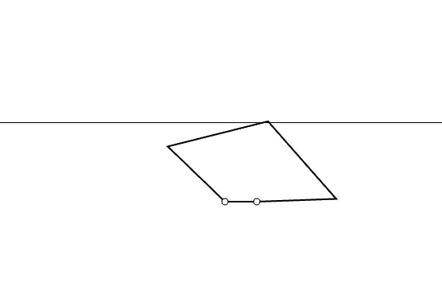
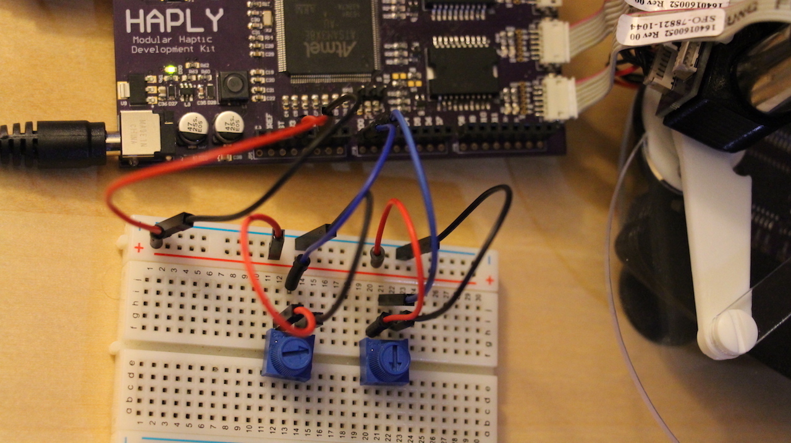
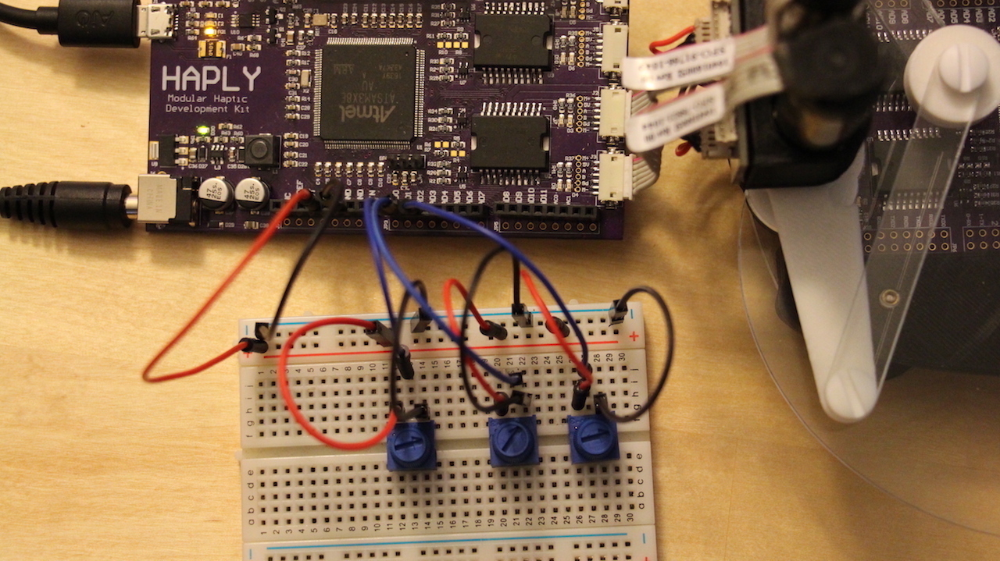

Welcome to Working with Walls!
==============================

These lessons will build on the basic knowledge already accumulated, and
bring in properties of **real physical elements**. As the title suggests
we'll be focusing our attention on **walls**, but throughout these
lessons we'll discuss how elements of walls can be **extrapolated** to a
variety of **other haptic environments**.

Recommended Order
-----------------

You'll find that these lessons build on eachother quite a bit, as we'll
be starting with a basic wall and messing with the parameters as we go
on. WIth that in mind, see below for the recommeded lesson order -

1.  [Haplet To Angles to
    Wall](../02_Working%20with%20Walls/01_HapletToAngles_Wall.md)



2.  [Angles To Haplet PDE to
    Wall](../02_Working%20with%20Walls/02_AnglesToHaplet_Wall_PDE.md)



3.  [Haplet To Angles to Stiff
    Wall](../02_Working%20with%20Walls/03_HapletToAngles_WallStiffness.md)


4.  [Haplet To Angles to Stiff Dampening
    Wall](../02_Working%20with%20Walls/04_HapletToAngles_WallStiffnessDamper.md)



5.  [Angles to Haplet PDE to Complete
    Wall](../02_Working%20with%20Walls/05_HapletToAngles_CompleteWall.md)



6.  [Haplet to Angles to Stiff Dampening Moving
    Wall](../02_Working%20with%20Walls/06_AnglesToHaplet_MovingWall_PDE.md)


The Basic Wall
==============

Now that we've covered and understood the basics of how to read outputs
from the haplet into animations on our computer using processing, we can
turn our attention to how to make the Haplet into a haptic device. The
basic concept of doing this is to send a torque (or force) output from
our computer back through the motors and along the arms of the Haplet.
Since we can track the Haplet's movement using the code from the last
set of lessons, we can "trigger" our force output with a dependancy on
the position of the end effector of the Haplet. The simplest form of
this is a line which upon reaching will result in a force away from the
line. In a flat plane, this is also known as a wall!

Setup
=====

For this lesson you don't have to worry about the potentiometer setups;
for now we'll just be using the Haplet. But we'll get back to some
potentiometer work in later lessons, so don't forget about them
completely.

However, since more than 3.3 Volts is required to have our wall push
back, we'll be using external power. Luckily this is easy with the Haply
board, just plug the external power source.

Plug the power in to the Haply board as shown below.


Code
====

``` C
#include <stdlib.h>
#include <Encoder.h>
#include <pwm01.h>

//pin assignment
#define ENCJ21 28
#define ENCJ22 29
#define ENCJ2pwm 8
#define ENCJ2dir 22
#define ENCJ31 24
#define ENCJ32 25
#define ENCJ3pwm 9
#define ENCJ3dir 26

//rates defined
#define BAUD 9600
uint32_t PWMfreq=40000; //unsigned integer, 32 bits. more direct way to declare data type

//data to output
byte buf[] = {0,0};

//angles of arms, in degrees and radians
float th1_deg;
float th2_deg;
float th1;
float th2;

//defined dimensions - in processing will be scaled up x2000. This was empirically determined
float l= 0.05; //0.05 haplet arm length
float d= 0.02; //distance between arms at haplet base
float L= 0.065; //0.065 other haplet arm length

//wall parameters - in processing will be scaled up x2000. This was empirically determined
float y_W=0.05; // wall's position
float k_W=1000;  // wall's spring constant

//encoder pins
Encoder myEnc1(ENCJ21, ENCJ22);
Encoder myEnc2(ENCJ31, ENCJ32);

void setup() {
  SerialUSB.begin(BAUD);
  //inital values for arms- always start flat
  myEnc1.write(180.0*13856.0/360.0);
  myEnc2.write(0);

  //PWM motor init
  pinMode(ENCJ2pwm, OUTPUT);
  pinMode(ENCJ3pwm, OUTPUT);
  pinMode(ENCJ2dir, OUTPUT);
  pinMode(ENCJ3dir, OUTPUT);
  pwm_set_resolution(12);
  pwm_setup(ENCJ2pwm, PWMfreq, 1);
  pwm_setup(ENCJ3pwm, PWMfreq, 1);
  
}

void loop() {
  // reading angles in degrees and radians
  th1_deg = 360.0/13824.0*myEnc1.read();
  th2_deg = 360.0/13824.0*myEnc2.read();
  th1 = th1_deg*3.14159/180.0;
  th2 = th2_deg*3.14159/180.0;

  buf[0]=round(th1_deg);
  buf[1]=round(th2_deg)+80;
  
  SerialUSB.write(buf,2);

  // Forward Kinematics
  float c1=cos(th1);
  float c2=cos(th2);
  float s1=sin(th1);
  float s2=sin(th2);
  float xA=l*c1;
  float yA=l*s1;
  float xB=d+l*c2;
  float yB=l*s2;
  float R=pow(xA,2) +pow(yA,2);
  float S=pow(xB,2)+pow(yB,2);
  float M=(yA-yB)/(xB-xA);
  float N=0.5*(S-R)/(xB-xA);
  float a=pow(M,2)+1;
  float b=2*(M*N-M*xA-yA);
  float c=pow(N,2)-2*N*xA+R-pow(L,2);
  float Delta=pow(b,2)-4*a*c;
  float y_E=(-b+sqrt(Delta))/(2*a);
  float x_E=M*y_E+N;
  
  // Jacobian elements J^T=[J11,J12;J21,J22]
  float phi1=acos((x_E-l*c1)/L);
  float phi2=acos((x_E-d-l*c2)/L);
  float s21=sin(phi2-phi1);
  float s12=sin(th1-phi2);
  float s22=sin(th2-phi2);
  float J11=-(s1*s21+sin(phi1)*s12)/s21;
  float J12=(c1*s21+cos(phi1)*s12)/s21;
  float J21=sin(phi1)*s22/s21;
  float J22=-cos(phi1)*s22/s21;

  // contact force with the virtual wall
  float f_x=0; // forces at zero if no penetration into wall
  float f_y=0;
  float p_W=y_E-y_W; // penetration amount into the wall
if (p_W>0) { // if statement encapsulates below, if wall is penetrated
    f_y=k_W*p_W; // force equation

  // torques to be rendered: tau=J^T*f
  float tau1=J11*f_x+J12*f_y;
  float tau2=J21*f_x+J22*f_y;
  tau2=-tau2;

  //directional motor command
  if (tau1 <=0){
    digitalWrite(ENCJ2dir, HIGH);
  }
  else{
    digitalWrite(ENCJ2dir, LOW);
  }

  if (tau2 <=0){
    digitalWrite(ENCJ3dir, HIGH);
  }
  else{
    digitalWrite(ENCJ3dir, LOW);
  }
//torque to apply
  tau1= abs(tau1);
  tau2= abs(tau2);
  if (tau1>1){
    tau1=1;
  }
  if (tau2>1){
    tau2=1;
  }
  //torque to duty cycle
  int duty1=4095*tau1;
  int duty2=4095*tau2;

  pwm_write_duty(ENCJ2pwm, duty1);
  pwm_write_duty(ENCJ3pwm, duty2);  
}
else{ //if no force on wall
  pwm_write_duty(ENCJ2pwm, 0);
  pwm_write_duty(ENCJ3pwm, 0); 
}
}
```

Looking at the code, you'll see some familiar lines. We're still using
the same method to send data, and the basic order of processes should
still look the same. A small addition here is the inclusion of code
defining the wall distance and spring constant (Walls are just really
really stiff springs, after all). Slightly more important to understand
is the forward kinematics and contact force sections. Remember in the
previous lesson how we used forward kinematics to translate angles into
the position of the end effector? We can use this position to determine
our distance from the wall, after which we can pull our force trigger
once we are touching or past the wall. Part of the result of foward
kinematics here are solutions to the Jacobian matrix values, which we
can use to transform our forces into torques, which is what the motors
will naturally output to the end effector.

Wall Done, Now to Visualize!
============================

So now we have our output forces, and after writing and running the
correct code to your Haplet you'll see that there will be an invisible
wall you can't push past! The only thing left now is to visualize this
in Processing, this will give us a better idea of where exactly our wall
is. Move on to the
[AnglesToHaplet\_Wall\_PDE](../02_Working%20with%20Walls/02_AnglesToHaplet_Wall_PDE.md)
to see how this is done!

Visualizing the Basic Wall
==========================

We have built a wall which is invisible in the real world, but feels
like a wall to our touch. Cool eh? Now, all we need to do is visualize
this wall on our computers. We've done similar tasks before in
processing, the only addition here is the creation of a straight line at
the appropriate height across the animation to represent the wall.

Code
====

Notice how the same method is used to send and receive data as in
previous lessons. Sending and recieving data between the Haply board and
the computer is always a crucial part of Haptics, so it's important to
understand how this works and how the data is treated to ensure accuracy
in the process.

``` C
// Animates a Kite (Symmetric 5-bar) Linkage, based on two bytes
// that are read from the serial port and interpreted as angular positions
// of the two input joints.
// Includes a wall at a set height

import processing.serial.*;

Serial myPort;

//Haplet dimensions in pixels
int l=100;
int L=150;
int d=40;

//Define wall dimension
int y_wall=100;

// define buffers to retrieve byte arrays from arduino side
float inByte1;
float inByte2;

// define angles for calculations
float th1;
float th2;

// required graphic objects
PShape kite, circle1, circle2;

void setup () {
  // set the window size:
  size(600, 400,P2D);

  // List all the available serial ports
  printArray(Serial.list()); // Uncomment to check out the right number for myPort

  // Open whatever port is the one you're using. (Uncomment the previous command)
  myPort = new Serial(this, Serial.list()[1], 9600);
  
  // set inital background:
  background(255);
  
  // create kite
  kite = createShape();
  kite.beginShape();
  kite.fill(255);
  kite.stroke(0);
  kite.strokeWeight(2);
  
  // Put all the vertices on O or C as an initial position
  kite.vertex(width/2, 2*height/3); // Create O (Vertex 0)
  kite.vertex(width/2, 2*height/3); // Create A (Vertex 1) 
  kite.vertex(width/2, 2*height/3); // Create E (Vertex 2) 
  kite.vertex(width/2+d, 2*height/3); // Create B (Vertex 3) 
  kite.vertex(width/2+d, 2*height/3); // Create C (Vertex 4)  
  kite.endShape(CLOSE);
  
  // draw little circles on motorized joints
  circle1 = createShape(ELLIPSE, width/2, 2*height/3, d/5, d/5); // little circle on O (motor 1)
  circle1.setStroke(color(0));
  circle2 = createShape(ELLIPSE, width/2+d, 2*height/3, d/5, d/5); // little circle on c (motor 2)
  circle2.setStroke(color(0));
  
  
}

void draw () {
  
   // Expand array size to the number of bytes you expect
  byte[] inBuffer = new byte[2];
  
  while (myPort.available() > 0) {
    inBuffer = myPort.readBytes(); // define inBuffer such that bytes sent from arduino side can be stored
    myPort.readBytes(inBuffer); // read from arduino
    if (inBuffer != null) { //if statement will trigger provided data is available
      
      // Convert the serial port readings to unsigned bytes (Remember bytes are unsigned in arduino and signed in processing!)
      inByte1=(inBuffer[0]>=0) ? float(inBuffer[0]) : float(inBuffer[0]+256); // one-liner if-else
      inByte2=(inBuffer[1]>=0) ? float(inBuffer[1]) : float(inBuffer[1]+256); // one-liner if-else
      
      th1=PI/180.0*inByte1;      //convert to radians
      th2=PI/180.0*(inByte2-80); //convert to radians (after subtracting 80 degrees that we had added on the ".ino" side.) 
      
      // forward kinematics
      float c1=cos(th1);
      float c2=cos(th2);
      float s1=sin(th1);
      float s2=sin(th2);
    
      float xA=l*c1;
      float yA=l*s1;
      float xB=d+l*c2;
      float yB=l*s2;
      float R=pow(xA,2) +pow(yA,2);
      float S=pow(xB,2)+pow(yB,2);
      float M=(yA-yB)/(xB-xA);
      float N=0.5*(S-R)/(xB-xA);
      float a=pow(M,2)+1;
      float b=2*(M*N-M*xA-yA);
      float c=pow(N,2)-2*N*xA+R-pow(L,2);
      float Delta=pow(b,2)-4*a*c;
      float y_E=(-b+sqrt(Delta))/(2*a);
      float x_E=M*y_E+N;
      
      // Update graphics
      background(255); // To clean up the left-overs of drawings from the previous loop!
      kite.setVertex(1,width/2+l*cos(th1), 2*height/3-l*sin(th1)); // Vertex A with th1 from encoder reading
      kite.setVertex(3,width/2+d+l*cos(th2), 2*height/3-l*sin(th2)); // Vertex B with th2 from encoder reading
      kite.setVertex(2,width/2+x_E, 2*height/3-y_E); // Vertex E from Fwd Kin calculations
      shape(kite); // Display the kite
      shape(circle1);
      shape(circle2);
      //draw wall
      stroke(0);
      line(0,2*height/3-y_wall,width,2*height/3-y_wall);
    }
  }
}
```

See the last few lines of code? Thats all it took to draw a wall, we
defined the height as a global variable and drawing is a simple command.

See below for an animation of what your wall should look and behave
like.


Next Steps
==========

So now that we understand the basics of creating and visualizing a
simple wall, its time to tweak things a bit. Remember when we said that
walls are just really really stiff springs? What if we change the
stiffness of that spring? In the next lesson we'll show how this can be
done using a potentiometer, allowing you to change a wall into a spring
in real time.

Stiff Wall
==========

As mentioned previously, we can think of walls and barriers as being
analogous to springs with varying spring constants. Since we have the
basics of building a wall down, we can take code which we used on our
initial wall and vary parameters which can change the nature of the
wall. In this lesson, we'll be focusing our attention on the spring
constant of the wall.

Setup
-----

In this lesson we'll be using a potentiometer along with the Haplet, see
the photo below for the setup.


In case the photo isn't clear, the potentiometer ground and power pins
correspond to GND and 3V3, while the analog output corresponds to AD0.
This is reflected in the code below.

Code
----

This code is based heavily on the code from the first lesson in this
section, so it may help to refer back to the basics if you're having
trouble here.

``` C
#include <stdlib.h>
#include <Encoder.h>
#include <pwm01.h>

//pin assignment
#define ENCJ21 24
#define ENCJ22 25
#define ENCJ2pwm 8
#define ENCJ2dir 22
#define ENCJ31 28
#define ENCJ32 29
#define ENCJ3pwm 9
#define ENCJ3dir 26
#define POTvalue A0

//rates defined
#define BAUD 9600
uint32_t PWMfreq=40000; //unsigned integer, 32 bits. more direct way to declare data type

//data to output
byte buf[] = {0,0};

//angles of arms, in degrees and radians
float th1_deg;
float th2_deg;
float th1;
float th2;

//defined dimensions - in processing will be scaled up x2000. This was empirically determined
float l= 0.05; //0.05 cm to wall
float d= 0.02; //distance between arms at haplet base
float L= 0.065; //0.065 haplet arm length

//wall parameters - in processing will be scaled up x2000. This was empirically determined
float y_W=0.05; // wall's position
float k_W; //Pot input ranges from 0 to 1023 (10 bit reading), so it will be mapped to go from 10 to 1000
// k_W represents the wall's spring constant

//encoder pins
Encoder myEnc1(ENCJ21, ENCJ22);
Encoder myEnc2(ENCJ31, ENCJ32);

void setup() {
  SerialUSB.begin(BAUD);
  //inital values for arms- always start flat
  myEnc1.write(180.0*13856.0/360.0);
  myEnc2.write(0);

  //Pot input resolution
  analogReadResolution(10);

  //PWM motor init
  pinMode(ENCJ2pwm, OUTPUT);
  pinMode(ENCJ3pwm, OUTPUT);
  pinMode(ENCJ2dir, OUTPUT);
  pinMode(ENCJ3dir, OUTPUT);
  pwm_set_resolution(12);
  pwm_setup(ENCJ2pwm, PWMfreq, 1);
  pwm_setup(ENCJ3pwm, PWMfreq, 1);
  
}

void loop() {
  //setting wall stiffness
  k_W= analogRead(POTvalue);
  k_W= map(k_W, 0, 1023, 0, 10000); // mapping values as mentioned above

  // reading angles in degrees and radians
  th1_deg = 360.0/13824.0*myEnc1.read();
  th2_deg = 360.0/13824.0*myEnc2.read();
  th1 = th1_deg*3.14159/180.0;
  th2 = th2_deg*3.14159/180.0;

  buf[0]=round(th1_deg);
  buf[1]=round(th2_deg)+80;
  
  SerialUSB.write(buf,2);

  // Forward Kinematics
  float c1=cos(th1);
  float c2=cos(th2);
  float s1=sin(th1);
  float s2=sin(th2);
  float xA=l*c1;
  float yA=l*s1;
  float xB=d+l*c2;
  float yB=l*s2;
  float R=pow(xA,2) +pow(yA,2);
  float S=pow(xB,2)+pow(yB,2);
  float M=(yA-yB)/(xB-xA);
  float N=0.5*(S-R)/(xB-xA);
  float a=pow(M,2)+1;
  float b=2*(M*N-M*xA-yA);
  float c=pow(N,2)-2*N*xA+R-pow(L,2);
  float Delta=pow(b,2)-4*a*c;
  float y_E=(-b+sqrt(Delta))/(2*a);
  float x_E=M*y_E+N;
  
  // Jacobian elements J^T=[J11,J12;J21,J22]
  float phi1=acos((x_E-l*c1)/L);
  float phi2=acos((x_E-d-l*c2)/L);
  float s21=sin(phi2-phi1);
  float s12=sin(th1-phi2);
  float s22=sin(th2-phi2);
  float J11=-(s1*s21+sin(phi1)*s12)/s21;
  float J12=(c1*s21+cos(phi1)*s12)/s21;
  float J21=sin(phi1)*s22/s21;
  float J22=-cos(phi1)*s22/s21;

  // contact force with the virtual wall
  float f_x=0; // forces at zero if no penetration into wall
  float f_y=0;
  float p_W=y_E-y_W; // penetration amount into the wall
if (p_W>0) { // if statement encapsulates below
    f_y=-k_W*p_W;// force equation

  // torques to be rendered: tau=J^T*f
  float tau1=J11*f_x+J12*f_y;
  float tau2=J21*f_x+J22*f_y;
  tau2=-tau2;

  //directional motor command
  if (tau1 <=0){
    digitalWrite(ENCJ2dir, HIGH);
  }
  else{
    digitalWrite(ENCJ2dir, LOW);
  }

  if (tau2 <=0){
    digitalWrite(ENCJ3dir, HIGH);
  }
  else{
    digitalWrite(ENCJ3dir, LOW);
  }
//torque to apply
  tau1= abs(tau1);
  tau2= abs(tau2);
  if (tau1>1){
    tau1=1;
  }
  if (tau2>1){
    tau2=1;
  }
  //torque to duty cycle
  int duty1=4095*tau1;
  int duty2=4095*tau2;

  pwm_write_duty(ENCJ2pwm, duty1);
  pwm_write_duty(ENCJ3pwm, duty2);  
}
else{ //if no force on wall
  pwm_write_duty(ENCJ2pwm, 0);
  pwm_write_duty(ENCJ3pwm, 0); 
}
}
```

The primary differences in the code here relate to the declaration of a
new variable, which we will use to change the wall's spring constant.
Follow this variable through the code to see how it is finally used in
our force equation. It may be useful to recall the methods used to read
potentiometer values from previous sections as well.

Next Steps
----------

To visualize this code, run our visualization code from last lesson.
Since our wall is in the same position as before, this should work just
fine. Now, try to mess with the code a little bit. Change the spring
constant dramatically higher, see what happens. Notice how shaky the end
effector becomes? Lets talk a bit about that.

Our spring is pushing against us as we push towards it, but since our
spring constant is so high its causing an overshooting effect which is
constantly self correcting. This is hard to visualize in the real world,
but imagine a spring that actively put energy into the system. This is a
similar situation. In order to remedy this, we can do two things. First
is to "tune" our spring constant so that we aren't overshooting. Another
option is add a damper, which you can think of in the real world as
dashpot (google it if you havent seen one before, I had to when I first
learned about this). We'll investigate this in the following
[lesson](../02_Working%20with%20Walls/04_HapletToAngles_WallStiffnessDamper.md).

Putting a Damper on Things
==========================

As mentioned before, adding a dampening component to our force equation
will keep us from overshooting our position targets. By tuning our
spring constant and dampening parameters, we'll be able to create a wide
variety of virtual environments.

Setup
-----

For this setup we'll be adding a second potentiometer to our breadboard,
similar to when we were using two potentiometers to control a kite. See
the photo below for the configuration.


Code
----

The code below is based on the code from last lesson, but you'll see an
additional variable created which controls the dampening parameter.
Something of note is the mathematics being used here, stemming from the
fact that the dampening parameter requires a differential term. We take
advantage of micros() function here, which outputs the time in
microseconds since the code has been running, to give us time readings
for this term.

``` C
#include <stdlib.h>
#include <Encoder.h>
#include <pwm01.h>

//pin assignment
#define ENCJ21 24
#define ENCJ22 25
#define ENCJ2pwm 8
#define ENCJ2dir 22
#define ENCJ31 28
#define ENCJ32 29
#define ENCJ3pwm 9
#define ENCJ3dir 26
#define POTk_W A0
#define POTb_W A1
#define TIMER 1000 // upper bound for simulation to feel realistic (micros)

//rates defined
#define BAUD 9600
uint32_t PWMfreq=40000;//unsigned integer, 32 bits. more direct way to declare data type

//data to output
byte buf[] = {0,0};

//angles of arms, in degrees and radians
float th1_deg;
float th2_deg;
float th1;
float th2;

//defined dimensions - in processing will be scaled up x2000. This was empirically determined
float l= 0.05; //0.05 cm to wall
float d= 0.02; //distance between arms at haplet base
float L= 0.065; //0.065 haplet arm length

//wall parameters - in processing will be scaled up x2000. This was empirically determined
float y_W=0.05; // wall's position

//encoder pins
Encoder myEnc1(ENCJ21, ENCJ22);
Encoder myEnc2(ENCJ31, ENCJ32);

//K and B parameters - for wall's spring constant and dampening constant
float POTb, POTk;
float k_W; //Pot input ranges from 0 to 1023 (10 bit reading), so it will be mapped
float b_W; //Dampening parameter
double y_E_old;
float t_old;

void setup() {
  SerialUSB.begin(BAUD);
  //inital values for arms- always start flat
  myEnc1.write(180.0*13856.0/360.0);
  myEnc2.write(0);

  //Pot input resolution
  analogReadResolution(10);

  //PWM motor init
  pinMode(ENCJ2pwm, OUTPUT);
  pinMode(ENCJ3pwm, OUTPUT);
  pinMode(ENCJ2dir, OUTPUT);
  pinMode(ENCJ3dir, OUTPUT);
  pwm_set_resolution(12);
  pwm_setup(ENCJ2pwm, PWMfreq, 1);
  pwm_setup(ENCJ3pwm, PWMfreq, 1);
  
}

void loop() {
  // time must be included due to differential term for dampening constant
  float t = micros();
  //setting tuning parameters
  POTk= analogRead(POTk_W);
  POTb= analogRead(POTb_W);
  k_W= map(POTk, 0, 1023, 0, 5000); // comment this line to hardcode k_W
  //k_W=400.0; // uncomment this line to hardcode k_W

  //Dampening constant
  b_W = map(POTb, 0, 1023, 0, 1000); // comment this line to hardcode b_W
  //b_W = 420.0; // uncomment this line to hardcode b_W

 // reading angles in degrees and radians
  th1_deg = 360.0/13824.0*myEnc1.read();
  th2_deg = 360.0/13824.0*myEnc2.read();
  th1 = th1_deg*3.14159/180.0;
  th2 = th2_deg*3.14159/180.0;

  buf[0]=round(th1_deg);
  buf[1]=round(th2_deg)+80;
  
  SerialUSB.write(buf,2); // to send to processing

  // Forward Kinematics
  float c1=cos(th1);
  float c2=cos(th2);
  float s1=sin(th1);
  float s2=sin(th2);
  float xA=l*c1;
  float yA=l*s1;
  float xB=d+l*c2;
  float yB=l*s2;
  float R=pow(xA,2) +pow(yA,2);
  float S=pow(xB,2)+pow(yB,2);
  float M=(yA-yB)/(xB-xA);
  float N=0.5*(S-R)/(xB-xA);
  float a=pow(M,2)+1;
  float b=2*(M*N-M*xA-yA);
  float c=pow(N,2)-2*N*xA+R-pow(L,2);
  float Delta=pow(b,2)-4*a*c;
  double y_E=(-b+sqrt(Delta))/(2*a); //brings to cm
  double x_E=M*y_E+N;
  
  // Jacobian elements J^T=[J11,J12;J21,J22]
  float phi1=acos((x_E-l*c1)/L);
  float phi2=acos((x_E-d-l*c2)/L);
  float s21=sin(phi2-phi1);
  float s12=sin(th1-phi2);
  float s22=sin(th2-phi2);
  float J11=-(s1*s21+sin(phi1)*s12)/s21;
  float J12=(c1*s21+cos(phi1)*s12)/s21;
  float J21=sin(phi1)*s22/s21;
  float J22=-cos(phi1)*s22/s21;

if(t-t_old>=TIMER){ //loop control 
   
  // contact force with the virtual wall
  float f_x=0; // forces at zero if no penetration into wall
  float f_y=0; 
  float p_W=y_E-y_W; // penetration amount into the wall
if (p_W>0) { // if statement encapsulates below
    f_y=-k_W*p_W-b_W*(10000*(y_E-y_E_old)/(t-t_old)); //adding damper term here. 10000 is empirically determined

  // torques to be rendered: tau=J^T*f
  float tau1=J11*f_x+J12*f_y;
  float tau2=J21*f_x+J22*f_y;
  tau2=-tau2;

  //directional motor command
  if (tau1 <=0){
    digitalWrite(ENCJ2dir, HIGH);
  }
  else{
    digitalWrite(ENCJ2dir, LOW);
  }

  if (tau2 <=0){
    digitalWrite(ENCJ3dir, HIGH);
  }
  else{
    digitalWrite(ENCJ3dir, LOW);
  }
//torque to apply
  tau1= abs(tau1);
  tau2= abs(tau2);
  if (tau1>1){
    tau1=1;
  }
  if (tau2>1){
    tau2=1;
  }
  //torque to duty cycle
  int duty1=4095*tau1;
  int duty2=4095*tau2;

  pwm_write_duty(ENCJ2pwm, duty1);
  pwm_write_duty(ENCJ3pwm, duty2);  
}
else{ //if no force on wall
  pwm_write_duty(ENCJ2pwm, 0);
  pwm_write_duty(ENCJ3pwm, 0); 
}
 t_old=t;
 y_E_old= y_E;
}
}
```

Next Steps
----------

Try really experimenting with the above code and the potentiometer
values you choose. Notice how with some values the wall becomes
impossible to pass and causes overshooting. A similar situation happens
when the dampening parameter is set too high. When the spring constant
is lowered to almost nothing and the dampening parameter correctly
tuned, the wall goes from a spring to honey allowing you to move through
it slowly. See how we can use this to replicate many different
environments? Move on to the [next
lesson](../02_Working%20with%20Walls/05_HapletToAngles_CompleteWall.md)
to revisit moving walls with all these possible environments in mind.

The Great Wall of Varying Height
================================

We're nearly done with the creation of our virtual environment,
consisting of a spring wall and a dashpot. The only thing left to do is
to vary the height of our wall, this will be the finishing touch on our
system and allow us to "pull" on our end effector by changing it's
environment rather than it's position.

Setup
-----

We'll be adding a third potentiometer for this setup, but if you only
have two thats no problem. Simply comment out the code that controls
either spring constant or dampening parameter. Just make sure that the
hardcoded value is well tuned!


Code
----

Here, we'll be using a potentiometer for control of height, that means
we'll need a 3-byte array to send data. Notice the similarities of
methodology in sending our 3-byte array compared to the 2-byte array
we've used before.

``` C
#include <stdlib.h>
#include <Encoder.h>
#include <pwm01.h>

//pin assignment
#define ENCJ21 24
#define ENCJ22 25
#define ENCJ2pwm 8
#define ENCJ2dir 22
#define ENCJ31 28
#define ENCJ32 29
#define ENCJ3pwm 9
#define ENCJ3dir 26
#define POTk_W A0
#define POTb_W A1
#define POTh_W A2
#define TIMER 1000 //upper bound to feel realistic (micros)

//rates defined
#define BAUD 9600
uint32_t PWMfreq=40000; //unsigned integer, 32 bits. more direct way to declare data type

//data to pass to processing: motor angles and wall height
byte buf[] = {0,0,0};

//angles of arms, in degrees and radians
float th1_deg;
float th2_deg;
float th1;
float th2;

//defined dimensions - in processing will be scaled up x2000. This was empirically determined
float l= 0.05; //first arm length
float d= 0.02; //distance at base
float L= 0.065; //second arm length

//wall parameters - in processing will be scaled up x2000. This was empirically determined
float y_W=0.05; // wall's position - will be changed
int h_W; // for reading wall height

//encoder pins
Encoder myEnc1(ENCJ21, ENCJ22);
Encoder myEnc2(ENCJ31, ENCJ32);

//K and B parameters
float POTb, POTk;
float k_W; //Pot input ranges from 0 to 1023 (10 bit reading), so it will be mapped
float b_W; //Dampening parameter, will be mapped
double y_E_old;
float t_old;

void setup() {
SerialUSB.begin(BAUD);
//inital values for arms- always start flat
myEnc1.write(180.0*13856.0/360.0);
myEnc2.write(0);

//Pot input resolution
analogReadResolution(10);

//PWM motor init
pinMode(ENCJ2pwm, OUTPUT);
pinMode(ENCJ3pwm, OUTPUT);
pinMode(ENCJ2dir, OUTPUT);
pinMode(ENCJ3dir, OUTPUT);
pwm_set_resolution(12);
pwm_setup(ENCJ2pwm, PWMfreq, 1);
pwm_setup(ENCJ3pwm, PWMfreq, 1);

}

void loop() {
// time must be included due to differential term for dampening constant
float t = micros();
//setting tuning parameters
POTk= analogRead(POTk_W);
POTb= analogRead(POTb_W);
k_W= map(POTk, 0, 1023, 0, 5000);
//k_W=400.0;

//Dampening constant
b_W = map(POTb, 0, 1023, 0, 1000);
//b_W = 420.0;

//Wall height change, storing output from H_W into pot1
h_W = analogRead(POTh_W);
h_W = map(h_W, 0, 1023, 0, 255);
//Map function for floats. map() function does not work for floats
float percent = h_W/255.0;
y_W= 0.04 + percent *(0.07-0.04);

//angle determination
th1_deg = 360.0/13824.0*myEnc1.read();
th2_deg = 360.0/13824.0*myEnc2.read();
th1 = th1_deg*3.14159/180.0;
th2 = th2_deg*3.14159/180.0;

buf[0]=round(th1_deg);
buf[1]=round(th2_deg)+80;
buf[2]=round(h_W); //to be multiplied by 2000 for scaling

SerialUSB.write(buf,3); // to send to processing

// Forward Kinematics
float c1=cos(th1);
float c2=cos(th2);
float s1=sin(th1);
float s2=sin(th2);
float xA=l*c1;
float yA=l*s1;
float xB=d+l*c2;
float yB=l*s2;
float R=pow(xA,2) +pow(yA,2);
float S=pow(xB,2)+pow(yB,2);
float M=(yA-yB)/(xB-xA);
float N=0.5*(S-R)/(xB-xA);
float a=pow(M,2)+1;
float b=2*(M*N-M*xA-yA);
float c=pow(N,2)-2*N*xA+R-pow(L,2);
float Delta=pow(b,2)-4*a*c;
double y_E=(-b+sqrt(Delta))/(2*a); //brings to cm
double x_E=M*y_E+N;

// Jacobian elements J^T=[J11,J12;J21,J22]
float phi1=acos((x_E-l*c1)/L);
float phi2=acos((x_E-d-l*c2)/L);
float s21=sin(phi2-phi1);
float s12=sin(th1-phi2);
float s22=sin(th2-phi2);
float J11=-(s1*s21+sin(phi1)*s12)/s21;
float J12=(c1*s21+cos(phi1)*s12)/s21;
float J21=sin(phi1)*s22/s21;
float J22=-cos(phi1)*s22/s21;

if(t-t_old>=TIMER){ //loop control

// contact force with the virtual wall
float f_x=0;
float f_y=0;
float p_W=y_E-y_W; // penetration amount into the wall
if (p_W>0) { // if statement encapsulates below
f_y=-k_W*p_W-b_W*(10000*(y_E-y_E_old)/(t-t_old)); //adding damper term here

// torques to be rendered: tau=J^T*f
float tau1=J11*f_x+J12*f_y;
float tau2=J21*f_x+J22*f_y;
tau2=-tau2;

//directional motor command
if (tau1 <=0){
digitalWrite(ENCJ2dir, HIGH);
}
else{
digitalWrite(ENCJ2dir, LOW);
}

if (tau2 <=0){
digitalWrite(ENCJ3dir, HIGH);
}
else{
digitalWrite(ENCJ3dir, LOW);
}
//torque to apply
tau1= abs(tau1);
tau2= abs(tau2);
if (tau1>1){
tau1=1;
}
if (tau2>1){
tau2=1;
}
//torque to duty cycle
int duty1=4095*tau1;
int duty2=4095*tau2;

pwm_write_duty(ENCJ2pwm, duty1);
pwm_write_duty(ENCJ3pwm, duty2);
}
else{ //if no force on wall
pwm_write_duty(ENCJ2pwm, 0);
pwm_write_duty(ENCJ3pwm, 0);
}
t_old=t;
y_E_old= y_E;
}
}
```

Another slight difference in our code here is the use of our map
function for the case of the wall height. Because the map() function is
not made to work with floating point values, we made one ourselves. This
is the only time we'll have to do this for this set of lessons, but an
important takeaway here is that not all functions work for all
datatypes.

Next Steps
----------

Now the only thing left to do is visualize our wall correctly, since our
Processing code from previous lessons is expecting a 2-byte array and
isn't coded to vary the height of the wall. Move on to the [final
lesson](../02_Working%20with%20Walls/06_AnglesToHaplet_MovingWall_PDE.md)
in this section to see how this is done!

Visualizing the Final Wall
==========================

We have reached our final lesson for creating a wall virtual
environment. Our code renders a movable wall wherein we can control both
the spring constant and the dampening parameter. The only thing left to
do is to visualize this wall correctly in Processing.

Code
----

Our code is similar to the Processing code from similar lessons, the
only exception is that we are expecting a 3-byte array rather than the
2-byte arrays which we've been using in past lessons.

``` C
// Animates a Kite (Symmetric 5-bar) Linkage, based on two bytes
// that are read from the serial port and interpreted as angular positions
// of the two input joints.
// Includes a wall at a variable height

import processing.serial.*;

Serial myPort;

//Haplet dimensions in pixels
int l=100;
int L=130;
int d=40;

// wall dimension, left undefined. 
// This data will be contained in the buffer defined in the draw function
float y_wall;

// define buffers to retrieve angle byte arrays from arduino side
float inByte1;
float inByte2;

// define angles for calculations
float th1;
float th2;

// required graphic objects
PShape kite, circle1, circle2;

void setup () {
  // set the window size:
  size(600, 400,P2D);

  // List all the available serial ports
  printArray(Serial.list()); // Uncomment to check out the right number for myPort

  // Open whatever port is the one you're using. (Uncomment the previous command)
  myPort = new Serial(this, Serial.list()[1], 9600);
  
  // set inital background:
  background(255);
  
  // create kite
  kite = createShape();
  kite.beginShape();
  kite.fill(255);
  kite.stroke(0);
  kite.strokeWeight(2);
  
  // Put all the vertices on O or C as an initial position
  kite.vertex(width/2, 2*height/3); // Create O (Vertex 0)
  kite.vertex(width/2, 2*height/3); // Create A (Vertex 1) 
  kite.vertex(width/2, 2*height/3); // Create E (Vertex 2) 
  kite.vertex(width/2+d, 2*height/3); // Create B (Vertex 3) 
  kite.vertex(width/2+d, 2*height/3); // Create C (Vertex 4)  
  kite.endShape(CLOSE);
  
  // draw little circles on motorized joints
  circle1 = createShape(ELLIPSE, width/2, 2*height/3, d/5, d/5); // little circle on O (motor 1)
  circle1.setStroke(color(0));
  circle2 = createShape(ELLIPSE, width/2+d, 2*height/3, d/5, d/5); // little circle on c (motor 2)
  circle2.setStroke(color(0));
  
  
}

void draw () {
  
   // Expand array size to the number of bytes you expect
  byte[] inBuffer = new byte[3];
  
  while (myPort.available() > 0) {
    inBuffer = myPort.readBytes(); // define inBuffer such that bytes sent from arduino side can be stored
    myPort.readBytes(inBuffer); // read from arduino
    if (inBuffer != null) { //if statement will trigger provided data is available
      
      // Convert the serial port readings to unsigned bytes (Remember bytes are unsigned in arduino and signed in processing!)
      inByte1=(inBuffer[0]>=0) ? float(inBuffer[0]) : float(inBuffer[0]+256); // one-liner if-else
      inByte2=(inBuffer[1]>=0) ? float(inBuffer[1]) : float(inBuffer[1]+256); // one-liner if-else
      y_wall=(inBuffer[2]>=0) ? float(inBuffer[2]) : float(inBuffer[2]+256); // one-liner if-else
      
      th1=PI/180.0*inByte1;      //convert to radians
      th2=PI/180.0*(inByte2-80); //convert to radians (after subtracting 80 degrees that we had added on the ".ino" side.) 
      
      // mapping y_wall into pixels. 2000 is empirically found
      y_wall = map(y_wall, 0, 255, 0.04*2000, 0.07*2000);

      // forward kinematics
      float c1=cos(th1);
      float c2=cos(th2);
      float s1=sin(th1);
      float s2=sin(th2);
    
      float xA=l*c1;
      float yA=l*s1;
      float xB=d+l*c2;
      float yB=l*s2;
      float R=pow(xA,2) +pow(yA,2);
      float S=pow(xB,2)+pow(yB,2);
      float M=(yA-yB)/(xB-xA);
      float N=0.5*(S-R)/(xB-xA);
      float a=pow(M,2)+1;
      float b=2*(M*N-M*xA-yA);
      float c=pow(N,2)-2*N*xA+R-pow(L,2);
      float Delta=pow(b,2)-4*a*c;
      float y_E=(-b+sqrt(Delta))/(2*a);
      float x_E=M*y_E+N;
      
      // Update graphics
      background(255); // To clean up the left-overs of drawings from the previous loop!
      kite.setVertex(1,width/2+l*cos(th1), 2*height/3-l*sin(th1)); // Vertex A with th1 from encoder reading
      kite.setVertex(3,width/2+d+l*cos(th2), 2*height/3-l*sin(th2)); // Vertex B with th2 from encoder reading
      kite.setVertex(2,width/2+x_E, 2*height/3-y_E); // Vertex E from Fwd Kin calculations
      shape(kite); // Display the kite
      shape(circle1);
      shape(circle2);
      //draw wall
      stroke(0);
      line(0,2*height/3-y_wall,width,2*height/3-y_wall);
    }
  }
}
```

The only treatment required for the third byte in our 3-byte array is
the mapping function. In this case we are using it to map between
potentiometer values, to pixels of height on our screen.

See below for what the final animation looks like!


Moving On
---------

We've now completed working with walls! The basics of creating
interactive environments exist at your fingertips.

The lessons from here on out will focus on slightly less general topics
that are based around other capabilities of the Haplet and haptics as a
whole.
