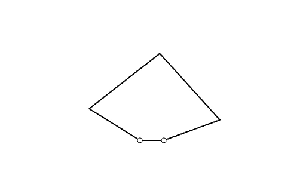

# Tracing and Moving
Now that we have covered the basics, lets move on to some more abstract tasks. In both of these lessons, rather than moving our end effector with our hands we'll be commanding the end effector from the computer side. This will invoke past lessons' methodology of sending data between our Haplet and Processing, but in a very different context. It is absolutely recommended to have a solid understanding of previous lessons before delving into this series.

## Recommended Order
This series of lessons is __comparatively short__ to the previous ones in terms of __number of files__ as we've completed the very basics of working with our Haplet. That being said, because these are more __abstract tasks__ each lesson is far more dense than the previous ones. The recommended lesson order is shown below

1. [Draw Circle](../04_Tracing%20and%Moving/01_DrawCircle.md)

2. [Tracking Mouse: Torque to Haplet](../04_Tracing%20and%Moving/02_TorqueToHaplet.md)

3. [Tracking Mouse: Mouse Tracker to Torque PDE](../04_Tracing%20and%Moving/03_MouseTrackerToTorque)

