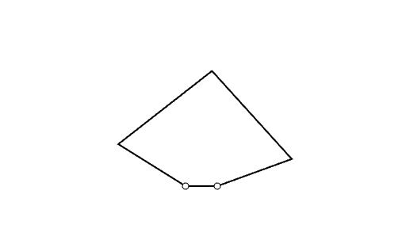
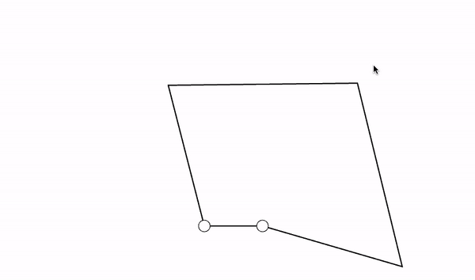

Tracing and Moving
==================

Now that we have covered the basics, lets move on to some more abstract
tasks. In both of these lessons, rather than moving our end effector
with our hands we'll be commanding the end effector from the computer
side. This will invoke past lessons' methodology of sending data between
our Haplet and Processing, but in a very different context. It is
absolutely recommended to have a solid understanding of previous lessons
before delving into this series.

Recommended Order
-----------------

This series of lessons is **comparatively short** to the previous ones
in terms of **number of files** as we've completed the very basics of
working with our Haplet. That being said, because these are more
**abstract tasks** each lesson is far more dense than the previous ones.
The recommended lesson order is shown below

1.  [Draw Circle](/04_Tracing%20and%20Moving/01_DrawCircle.md)



2.  [Tracking Mouse: Torque to
    Haplet](/04_Tracing%20and%20Moving/02_TorqueToHaplet.md)

3.  [Tracking Mouse: Mouse Tracker to Torque
    PDE](/04_Tracing%20and%20Moving/03_MouseTrackertoTorque_PDE.md)



Drawing A Circle
================

Setup
-----

For this lesson set we won't be using the breadboard, only the Haplet.
So we only need our power input and USB port connection to the computer.

Coding Philosophy
-----------------

The overall principle of coding here will be to first parameterize a
circle with time. We'll do this using the millis() function. Once we've
defined our circle, the next step should look familiar. Remember the way
we defined our wall force by using distance "into" the wall, similar to
a spring force equation? Exact same concept here, we would like our
force **to** the circle to be scaling with distance, so we can imagine
our pulling force as a spring dragging our end effector with it! The
only real difference between the wall of the past and the circle present
here is the direction of force.

``` C
#include<stdlib.h>
#include <Encoder.h>
#include <pwm01.h>

// define the encoder pins
Encoder myEnc1(28, 29); // J2
Encoder myEnc2(24, 25); // J3

// define PWM related variables
uint32_t pwmPin1=9; //J2
uint32_t dirPin1= 26;
uint32_t pwmPin2=8; //J3
uint32_t dirPin2= 22;
int32_t  pwm_freq = 40000; //Hz

// Serial COM port buffer variable
byte buf[]={0,0}; // define a buffer array with a byte of data in each entry
// Somewhat low resolution ok, as this is just for visualization in processing

// angular variables - from encoder
float th1_degree;
float th2_degree;
float th1; // in radians
float th2; // in radians

// Link dimensions
float l=0.05; // in meters
float L=0.065;
float d=0.02;

// Circular Dimensions
float x_C,y_C;
float r=0.025;
float x_0=0.01;
float y_0=0.08;
float omega=2*PI/10.0;

// Gain variables
float k = 150.0;

void setup() {
SerialUSB.begin(9600);

// setup encoders
float offset = 0.0;
myEnc1.write((180.0 - offset) * 13856.0 / 360.0);
myEnc2.write(-offset * 13856.0 / 360.0);

// setup PWMs for motors
pinMode(dirPin1, OUTPUT);
pinMode(pwmPin1, OUTPUT);
pinMode(dirPin2, OUTPUT);
pinMode(pwmPin2, OUTPUT);
pwm_set_resolution(12);
pwm_setup(pwmPin1 , pwm_freq, 1);  // Pin 8 freq set to "pwm_freq2" on clock
pwm_setup(pwmPin2, pwm_freq, 1);  // Pin 9 freq set to "pwm_freq2" on clock B
}

void loop() {
float timer = millis()/1000.0; // timer for parameterizing circle

// circle trajectory -
x_C=r*cos(omega*timer)+x_0;
y_C=r*sin(omega*timer)+y_0;

// read the angles from encoder measurements
th1_degree = 360.0/13824.0*myEnc1.read();
th2_degree = 360.0/13824.0*myEnc2.read();
th1=th1_degree*3.14159/180.0;
th2=th2_degree*3.14159/180.0;

// send the angles to the processing sketch via the serial port
buf[0]=round(th1_degree);
buf[1]=round(th2_degree)+80; // we add 80 degrees just to make sure we don't hit any negative angle to pass as unsigned byte (we will subtract 80 when visualizing!)
SerialUSB.write(buf ,2);

// Forward Kinematics
float c1=cos(th1);
float c2=cos(th2);
float s1=sin(th1);
float s2=sin(th2);
float xA=l*c1;
float yA=l*s1;
float xB=d+l*c2;
float yB=l*s2;
float R=pow(xA,2) +pow(yA,2);
float S=pow(xB,2)+pow(yB,2);
float M=(yA-yB)/(xB-xA);
float N=0.5*(S-R)/(xB-xA);
float a=pow(M,2)+1;
float b=2*(M*N-M*xA-yA);
float c=pow(N,2)-2*N*xA+R-pow(L,2);
float Delta=pow(b,2)-4*a*c;
// Result of forward kinematics - X and Y of the endpoint
float y_E=(-b+sqrt(Delta))/(2*a);
float x_E=M*y_E+N;

// Jacobian elements J^T=[J11,J12;J21,J22]
float phi1=acos((x_E-l*c1)/L);
float phi2=acos((x_E-d-l*c2)/L);
float s21=sin(phi2-phi1);
float s12=sin(th1-phi2);
float s22=sin(th2-phi2);
float J11=-(s1*s21+sin(phi1)*s12)/s21;
float J12=(c1*s21+cos(phi1)*s12)/s21;
float J21=sin(phi1)*s22/s21;
float J22=-cos(phi1)*s22/s21;

//Componential distance calculation

float dist_X = x_C-x_E;
float dist_Y = y_C-y_E;

//Force calculation

float f_x = k*dist_X;
float f_y = k*dist_Y;

// torques to be rendered: tau=J^T*f
float tau1=J11*f_x+J12*f_y;
float tau2=J21*f_x+J22*f_y;
tau1=-tau1;

// command the motors (PWMs)
if (tau1 <= 0) {
digitalWrite(dirPin1, HIGH);
}
else {
digitalWrite(dirPin1, LOW);
}

if (tau2 <=  0) {
digitalWrite(dirPin2, HIGH);
}
else {
digitalWrite(dirPin2, LOW);
}

tau1 = abs(tau1);
tau2 = abs(tau2);
if (tau1>1){
tau1=1;
}
if (tau2>1){
tau2=1;
}
int duty1=4095*tau1;
int duty2=4095*tau2;

pwm_write_duty( pwmPin1, duty1 );
pwm_write_duty( pwmPin2, duty2 );

}
```

Something to take note of here is the use of only a k value; no
dampening parameter is used. This is not a huge deal, we just need to
carefully tune our k value so as not to overshoot our target. If you'd
like an extra exercise, try adding a dampening parameter similar to
previous lessons. It should add a little bit of smoothness to your
circle tracking if done correctly!

We can visualize this using processing sketches from [previous
lessons](../01_Getting%20Started/04_AnglesToHaplet_PDE.md). See below
for the action shot!


Next Steps
----------

If you didn't add a damper in the code, thats no problem. Try adding
your own *physical* damper, by either putting a higher friction material
underneath the end effector, or by pushing down on the top of the end
effector. See how much that smooths out the movement? I've always found
this really interesting, as it is a true combination of simulation code
with the surrounding environment.

There are still alot of things you can mess with in this code. Try
changing the shape you paramaterize to, or the starting points of the
shape. These are both shown the "circle trajectory" part of the code.
See what other shapes you can draw!

Mouse Tracker: Torques to Haplet
================================

We understand a bit about how to send torques to our Haplet, let's take
that concept a little bit further; let's have our Haplet follow our
mouse as we move it along the screen. We'll start in familiar territory,
sending the states of our encoders to Processing and recieving the
correct torque back to send to our motors. We'll focus on the Processing
side of things in the next lesson.

Code
----

For this task, we'll need higher precision values for passing data
between Processing and Arduino. To accomplish this, we'll make use of
those functions we went over in previous lessons for sending high
precision floats over the serial port.

``` C
#include<stdlib.h>
#include <Encoder.h>
#include <pwm01.h>

// define the encoder pins
Encoder myEnc1(28, 29); // J2
Encoder myEnc2(24, 25); // J3

// define PWM related variables
uint32_t pwmPin1=9; //J2
uint32_t dirPin1= 26;
uint32_t pwmPin2=8; //J3
uint32_t dirPin2= 22;
int32_t  pwm_freq = 40000; //Hz  
 
// forces to be received
byte inbuf[8]; //different way than previously used to initialize an 8 byte array

// forces
byte outbuf[8];
byte outbuf1[4];
byte outbuf2[4];
float th1, th2, tau1, tau2; // angles and torques to be applied

void setup() {
  SerialUSB.begin(115200); //faster baud rate to ensure data transfer is fast enough
  
  // setup encoders
  float offset = 0.0;
  myEnc1.write((180.0 - offset) * 13856.0 / 360.0);
  myEnc2.write(-offset * 13856.0 / 360.0);
  
  // setup PWMs for motors
  pinMode(dirPin1, OUTPUT);
  pinMode(pwmPin1, OUTPUT);
  pinMode(dirPin2, OUTPUT);
  pinMode(pwmPin2, OUTPUT);
  pwm_set_resolution(12);
  pwm_setup(pwmPin1 , pwm_freq, 1);  // Pin 8 freq set to "pwm_freq2" on clock
  pwm_setup(pwmPin2, pwm_freq, 1);  // Pin 9 freq set to "pwm_freq2" on clock B
}

// Data input and output loop control
long last_recieve = 0;

void loop() {

  // Reading angles from Encoders - turning into degrees
  th1 = 360.0/13824.0*myEnc1.read();
  th2 = 360.0/13824.0*myEnc2.read();

// sending angles to processing  
FloatToBytes(th1, outbuf1);
FloatToBytes(th2, outbuf2);
ArrayCopy(outbuf1, 0, outbuf, 0, 4);
ArrayCopy(outbuf2, 0, outbuf, 4, 4);
SerialUSB.write(outbuf,8);

  
  // Receiving torques from Processing
if( micros() - last_recieve >= 1000){ // loop control implimentation
  last_recieve = micros();
    if(SerialUSB.available() > 0){
    SerialUSB.readBytes(inbuf, 8); // receiving torques as an array
  }
}

//turning array into floats
byte inbuf1[4];
byte inbuf2[4];
ArrayCopy(inbuf, 0, inbuf1, 0, 4);
ArrayCopy(inbuf, 4, inbuf2, 0, 4);

tau1 = BytesToFloat(inbuf1);
tau2 = BytesToFloat(inbuf2);

    // command the motors (PWMs)
    if (tau1 <= 0) {
      digitalWrite(dirPin1, HIGH);
    }
    else {
      digitalWrite(dirPin1, LOW);
    }
  
    if (tau2 <=  0) {
      digitalWrite(dirPin2, HIGH);
    }
    else {
      digitalWrite(dirPin2, LOW);
    }
    
    tau1 = abs(tau1);
    tau2 = abs(tau2);
    if (tau1>1){
      tau1=1;
    }
    if (tau2>1){
      tau2=1;
    }
    int duty1=4095*tau1;
    int duty2=4095*tau2;
    
    pwm_write_duty( pwmPin1, duty1 );  
    pwm_write_duty( pwmPin2, duty2 );  
  
}


/**
 * Union definition for floating point and integer representation conversion
 */
typedef union{
    long val_l;
    float val_f;
} ufloat;

/**
 * Translates a 32-bit floating point into an array of four bytes
 * 
 * @note     None
 * @param    val: 32-bit floating point
 * @param    segments: array of four bytes
 * @return   None 
 */
void FloatToBytes(float val, byte segments[]){
    ufloat temp;

    temp.val_f = val;

    segments[3] = (byte)((temp.val_l >> 24) & 0xff);
    segments[2] = (byte)((temp.val_l >> 16) & 0xff);
    segments[1] = (byte)((temp.val_l >> 8) & 0xff);
    segments[0] = (byte)((temp.val_l) & 0xff);
}


/**
 * Translates an array of four bytes into a floating point
 * 
 * @note     None
 * @param    segment: the input array of four bytes
 * @return   Translated 32-bit floating point 
 */
float BytesToFloat(byte segments[]){
    ufloat temp;

    temp.val_l = (temp.val_l | (segments[3] & 0xff)) << 8;
    temp.val_l = (temp.val_l | (segments[2] & 0xff)) << 8;
    temp.val_l = (temp.val_l | (segments[1] & 0xff)) << 8;
    temp.val_l = (temp.val_l | (segments[0] & 0xff)); 

    return temp.val_f;
}

/**
 * Copies elements from one array to another
 * 
 * @note     None
 * @param    src: The source array to be copied from
 * @param    src_index: The starting index of the source array
 * @param    dest: The destination array to be copied to
 * @param    dest_index: The starting index of the destination array
 * @param    len: Number of elements to be copied
 * @return   None 
 */
void ArrayCopy(byte src[], int src_index, byte dest[], int dest_index, int len ){
    for(int i = 0; i < len; i++){
        dest[dest_index + i] = src[src_index + i];
    }
}
```

The overall flow of the code here is, in a sense, the intended flow in
the field of haptics. We're using our Haply board as a straightforward
microcontroller and saving the calculations for Processing on our
computer. Computers have much more processing power, so as simulations
and animations become more intensive this becomes the optimal way to
operate. The controller's job is to output the current state of the end
effector, and expect to recieve torques which it then applys to the
devices. Running this process on a loop and letting the computer handle
the calculations makes an efficient way to run complex simulations.

Next Steps
----------

The firmware (Arduino) side of the code is complete, now we just need to
program what we want our software (Processing) to do. This will involve
completeing the force calculations and the animation updates. Move on to
the [next lesson](../04_Tracing%20and%Moving/03_MouseTrackerToTorque) to
see how this is done!

Mouse Tracker to Torque
=======================

As said before, the general rule to follow in the context of haptics is
to let the computer handle all the, well, computation! This includes the
animation steps as well, so that all that is left is the data and
application of force to the end effector. This is best handled by the
microcontroller, or in our case the Haply board. We went over the Haply
board in the previous lesson; here we'll be focusing our attention on
the Processing side of things.

Code
----

Similar to last lesson, in the code below we are using functions to send
a recieve floats with high precision. The process of drawing in the code
is similar to previous lessons as well.

``` C
import processing.serial.*;
import java.lang.Math;

Serial myPort;

// Haplet link lengths, 50 is pixels per cm, 100 cm to meter
float l=0.05*50*100; // length l in pixels
float L=0.065*50*100; // length L in pixels
float d=0.02*50*100; // length d in pixels

// Mouse position
float x_m,y_m;

// required graphic objects
PShape kite, circle1, circle2;

// data to be input
float bufin1;
float bufin2;
float th1, th2;

void setup () {
  // set the window size:
  size(1000, 700,P2D);
  
    // List all the available serial ports
  printArray(Serial.list()); // Uncomment to check out the right number for myPort

  // Open whatever port is the one you're using. (Uncomment the previous command)
  myPort = new Serial(this, Serial.list()[1], 9600);

  // set buffer size to 8 bytes
  myPort.buffer(8);
  // set inital background:
  background(255);
  
  // create kite
  kite = createShape();
  kite.beginShape();
  kite.fill(255);
  kite.stroke(0);
  kite.strokeWeight(2);
  
  // Put all the vertices on O or C as an initial position
  kite.vertex(width/2, 2*height/3); // Create O (Vertex 0)
  kite.vertex(width/2, 2*height/3); // Create A (Vertex 1) 
  kite.vertex(width/2, 2*height/3); // Create E (Vertex 2) 
  kite.vertex(width/2+d, 2*height/3); // Create B (Vertex 3) 
  kite.vertex(width/2+d, 2*height/3); // Create C (Vertex 4)  
  kite.endShape(CLOSE);
  
  // draw little circles on motorized joints
  circle1 = createShape(ELLIPSE, width/2, 2*height/3, d/5, d/5); // little circle on O (motor 1)
  circle1.setStroke(color(0));
  circle2 = createShape(ELLIPSE, width/2+d, 2*height/3, d/5, d/5); // little circle on c (motor 2)
  circle2.setStroke(color(0));

}

void draw () {
  byte[] bufin = new byte[8];
  byte[] bufin_1 = new byte[4];
  byte[] bufin_2 = new byte[4];
  
  // recieving angles from haplet
  bufin = myPort.readBytes();
  myPort.readBytes(bufin);
  if (bufin != null) {
    System.arraycopy(bufin, 0, bufin_1, 0, 4); // copy first angle (4 bytes of data) into bufin_1
    System.arraycopy(bufin, 4, bufin_2, 0 ,4); // repeat process for second angle, into buffin_2
    bufin1 = BytesToFloat(bufin_1); //convert angle bytes into floats for calculations
    bufin2 = BytesToFloat(bufin_2);

      // haplet angles to haplet position
      th1 = bufin1*PI/180.0; //in radians
      th2 = bufin2*PI/180.0;
      
      // forward kinematics
      float c1=cos(th1);
      float c2=cos(th2);
      float s1=sin(th1);
      float s2=sin(th2);
      float xA=l*c1;
      float yA=l*s1;
      float xB=d+l*c2;
      float yB=l*s2;
      float R=pow(xA,2) +pow(yA,2);
      float S=pow(xB,2)+pow(yB,2);
      float M=(yA-yB)/(xB-xA);
      float N=0.5*(S-R)/(xB-xA);
      float a=pow(M,2)+1;
      float b=2*(M*N-M*xA-yA);
      float c=pow(N,2)-2*N*xA+R-pow(L,2);
      float Delta=pow(b,2)-4*a*c;
      // Result of forward kinematics - X and Y of the endpoint
      float y_h=(-b+sqrt(Delta))/(2*a);
      float x_h=M*y_h+N; // SI units 

      // Jacobian values
      float phi1=acos((x_h-l*c1)/L);
      float phi2=acos((x_h-d-l*c2)/L);
      float s21=sin(phi2-phi1);
      float s12=sin(th1-phi2);
      float s22=sin(th2-phi2);
      float J11=-(s1*s21+sin(phi1)*s12)/s21;
      float J12=(c1*s21+cos(phi1)*s12)/s21;
      float J21=sin(phi1)*s22/s21;
      float J22=-cos(phi1)*s22/s21;
  
      // trajectory - mousepointer
      x_m = mouseX-500; 
      y_m = -mouseY+470;
  
      // Torques from difference in haplet and mouse, set gain, calculate force
 
      float dist_X = x_m-x_h;
      float dist_Y = y_m-y_h;
  
      float k = .006; // tuning parameter found empirically
  
      float f_x = k*dist_X;
      float f_y = k*dist_Y; 
  
      // torques to be rendered: tau=J^T*f
      float tau1=J11*f_x+J12*f_y;
      float tau2=J21*f_x+J22*f_y;
      tau1=-tau1;
      
      // Sending torques to arduino side
      byte[] tau_1 = new byte[4];
      byte[] tau_2 = new byte[4];
      byte[] bufout = new byte [8];
      
      // changing torque values into byte arrays
      tau_1 = FloatToBytes(tau1);
      tau_2 = FloatToBytes(tau2);
      // copying torques (as byte arrays) into bufout to send
      System.arraycopy(tau_1, 0, bufout, 0, 4);
      System.arraycopy(tau_2, 0, bufout, 4, 4);
      
      myPort.write(bufout);
  
 // Update graphics
      background(255); // To clean up the left-overs of drawings from the previous loop!
      kite.setVertex(1,width/2+l*cos(th1), 2*height/3-l*sin(th1)); // Vertex A with th1 from encoder reading
      kite.setVertex(3,width/2+d+l*cos(th2), 2*height/3-l*sin(th2)); // Vertex B with th2 from encoder reading
      kite.setVertex(2,width/2+x_h, 2*height/3-y_h); // Vertex E from Fwd Kin calculations
      shape(kite); // Display the kite
      shape(circle1);
      shape(circle2);
  }
}

/**
   * Translates a float point number to its raw binary format and stores it across four bytes
   *
   * @param    val floating point number
   * @return   array of 4 bytes containing raw binary of floating point number
   */ 
    private byte[] FloatToBytes(float val){
  
        byte[] segments = new byte[4];
  
        int temp = Float.floatToRawIntBits(val);
  
        segments[3] = (byte)((temp >> 24) & 0xff);
        segments[2] = (byte)((temp >> 16) & 0xff);
        segments[1] = (byte)((temp >> 8) & 0xff);
        segments[0] = (byte)((temp) & 0xff);

        return segments;
  
    }


  /**
   * Translates a binary of a float point to actual float point
   *
   * @param    segment array containing raw binary of floating point
   * @return   translated floating point number
   */     
    private float BytesToFloat(byte[] segment){
  
        int temp = 0;
  
        temp = (temp | (segment[3] & 0xff)) << 8;
        temp = (temp | (segment[2] & 0xff)) << 8;
        temp = (temp | (segment[1] & 0xff)) << 8;
        temp = (temp | (segment[0] & 0xff)); 
  
        float val = Float.intBitsToFloat(temp);
  
        return val;
    }
```

Comparing this code to that which was used on the Arduino side to draw a
circle, you'll see that the methodology to calculate force is identical.
By taking the angles which were recieved from the Haplet and applying
forward kinematics, we are able to calculate forces and then torques to
send back to the Haplet. We know from our previous lesson that the
Haplet is well equipped to apply these to the end effector.

See below to see this code in action!


Next Steps
----------

Running this code, you'll see that there are areas of error with the
tracking. Based on previous lessons, what are some ways to improve this
code? Remember the methodologies used to apply a damper to the system,
you'll find that any of these will improve the tracking.
