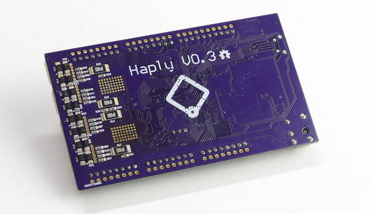

# Haply Arduino Firmware

## How To Use This Repository
In this repository you'll find the relevant firmware for the Haply Boards. Depending on what board you have you'll use a different firmware with the Haply APIs. See the API - specific repository for information on which firmware/ board combination is supported.

For general use, here's a quick guide.
Haply_M0_Firmware_V0_3 - Haply M0 Board  

Haply_M3_Firmware_V1_5 - Haply M3 Boards  

Haply_Modular_Haptic_Development_Kit_Firmware_V0_4 - Haply Dev Board  

## Low Level Demos
Low Level Demos is a series of lessons based around the firmware of the Haply boards. The lessons use the Arduino and Processing IDEs, and go through the basics of how haptic signals are sent and received in the Haplet - this is what the API does!
